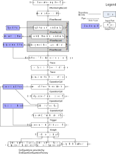

.. _new-trace-analysis:

Kieker Trace Analysis Stages
============================

The new Kieker trace analysis architecture provides a distinct set
of stages to populate a runtime model which is able to store
execution traces. These models can be used to create a variety of
dot-files containing dependency graphs and a grapML export. Following
the overall theme: Stages are distinguished in 

- **source** stages also called producer stages in TeeTime, they provide
  monitoring events.

- normal **stages** that may be called Stage if they perform some sort of
  processing and **filter** if they -- indeed -- filter events.

- **sink** stages that are at the end of a pipe and stage configuration, e.g.,
  save a file, send data to another service or view content on a display.

**Note:** These stages are faster and simpler than the old Kieker
trace analysis. However, they may lack functionality. There are
no sinks available for sequence diagrams and call trees.

List of stages:

- **LogsReaderCompositeStage** contains the ``DirectoryScannerStage`` and
  ``DirectoryReaderStage`` which read one or more Kieker log directory.

- **AllowedRecordsFilter** selects for ``IFlowRecord`` events. Thus, this
  analysis is not able to process ``OperationExecutionRecord``. However,
  you could create a ``OperationExecutionRecord2FlowRecordStage`` to generate
  proper ``IFlowRecord`` events. The stage also counts accepted and ignored
  events.

- **StaticModelsAssemblerStage** comprises 3 stages to fill the 'static' part
  of the model. These are the ``Type Model``, ``Assembly Model`` and 
  ``Deployment Model`` which contain component types, their assembly and their
  deployment onto machines or processes.

- **FlowRecordTraceReconstructionStage** reads in ``IFlowRecord`` events and
  generates ``Trace`` models from them.

- **TraceStatisticsDecoratorStage** computes statistics regarding traces
  utilizing ``DurRatioToRootParentCalculator``.

- **OperationCallExtractorStage** decomposes the ``Trace`` and sends out all
  ``OperationCall`` events separately.

- **ExecutionModelAssemblerStage** processes the ``OperationCall`` events and
  generates a aggregated model out of it representing all source target relationships
  within the model.

- **FullReponseTimeStatisticsStage** computes statistics for each ``OperationCall`` and
  collects the information in the ``Statistics Model``.

- **CallStatisticsStage**
- **TriggerOnTerminationStage** does not pass events on, but generates an ``Trigger``
  event. This is used to not produce an output for every processed operation (that could
  make sense in a service context), but only at the end of an analysis for after execution.

- **DependencyGraphCreatorStage** produces an graph utilizing a builder factory, e.g.,
  ``DeploymentLevelOperationDependencyGraphBuilderFactory``. They implement the
  ``kieker.analysis.graph.dependency.IDependencyGraphBuilderFactory`` interface.
  You may find **seven** different prepared builder in Kieker already for assembly,
  deployment and type level graphs.
- The writers generate dot-files and graphML-files respectively.

