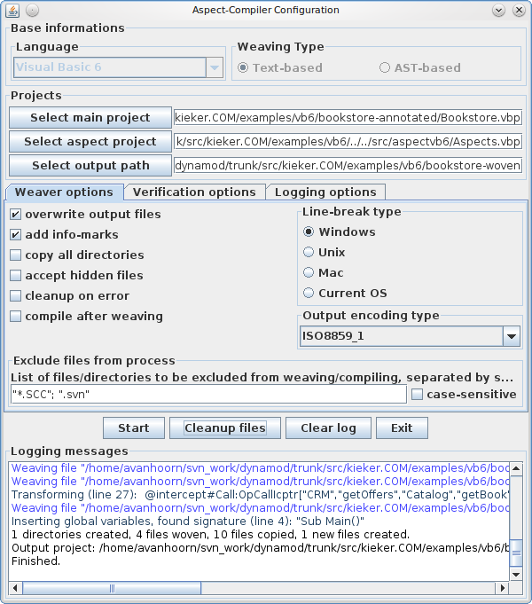

.. _instrumenting-software-kieker4com-aspects:

Kieker4COM Aspects 
==================

Please see :ref:`instrumenting-software-kieker4com-installation`
to learn how to install and use Kieker4COM. The pathes mentioned in this
document refer to the installation directory.

Kieker4COM VB6 Aspects Project
------------------------------

The Kieker4COM aspects project directory for VB6 can be found in the
directory ``src/vb6/Kieker4COM_aspects``. The VB6 project file, which can be
imported into the Visual Basic 6 IDE and can be used with
`Aspect VB6 <https://git.se.informatik.uni-kiel.de/kieker/aspectlegacy>`_,
is ``src/vb6/Kieker4COM_aspects/Aspects.vbp``.

Currently, the project includes two aspects for monitoring executions
(OpExecIcptr) and calls (OpCallIcptr) of VB6 routines, i.e., Procedures,
Functions, and Properties:

1. ``OpExecIcptr.cls``
2. ``OpCallIcptr.cls``

Using the Kieker4COM Aspects
----------------------------

The directory ``Kieker4COM\examples\vb6\bookstore-annotated`` contains a VB6
version of the Bookstore application, including annotations for the
Kieker4COM aspects. These annotations can be processed by
`Aspect VB6 <https://git.se.informatik.uni-kiel.de/kieker/aspectlegacy>`_.

Adding Annotations to VB6 Source Code
~~~~~~~~~~~~~~~~~~~~~~~~~~~~~~~~~~~~~

The examples were taken from the KiekerCOM example project
``Kieker4COM\examples\vb6\bookstore-annotated``.

OpExecIcptr
^^^^^^^^^^^

.. code:: VB.net
  
  '@intercept#Execution:OpExecIcptr["Bookstore","Class_Initialize"]
  
  Private Sub Class_Initialize()
  
  Set oCatalog = New catalog
  
  ...

OpCallIcptr
^^^^^^^^^^^

.. code:: VB.net
  
  Public Sub searchBook()
  
  '@intercept#Call:OpCallIcptr["Bookstore", "searchBook", "Catalog", "getBook"]
  
  catalog.getBook (False)
  
  '@intercept#Call:OpCallIcptr["Bookstore", "searchBook", "CRM", "getOffers"]
  
  crm().getOffers
  
  End Sub

Using AspectVB6 for Weaving the Monitoring Code
~~~~~~~~~~~~~~~~~~~~~~~~~~~~~~~~~~~~~~~~~~~~~~~

Using the command-line
^^^^^^^^^^^^^^^^^^^^^^

.. code:: bash
  
  /path/to/avb6c.sh \
    -s bookstore-annotated/Bookstore.vbp \
    -a ../../src/aspectvb6/Aspects.vbp -o bookstore-woven/

Using the GUI
^^^^^^^^^^^^^

