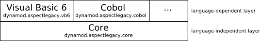
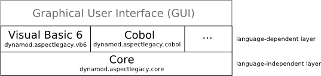

.. _instrumenting-software-vb-dev:

AspectLegacy (Visual Basic 6) Developer Guide 
=============================================

Layered Architecture
--------------------

For adapting the weaver framework to any additional programming
language, its architecture consists of a generic core component, which
serves as a base unit for any language-specific weaver adaption.
Consequently, the architecture of the weaver algorithm can be
illustrated as a two-layers model, consisting of a constitutive,
language-independent layer (core) and an adapting language-dependent
layer for any related programming language:

The lower layer (which can be considered a single core-component, since
it is implemented as an own Java package) provides the generic
functionality, e.g. file access, search for annotations within code,
verification and logging. The upper, language-dependent layer provides
the language-dependent functionality.

Additionally, an optional Graphical User Interface (GUI) is provided for
simplifying the weaver configuration process. The GUI can be seen as a
third layer, covering all language-dependent implementations, since it
provides the configuration functionality for all currently supported
languages:

Components of the core layer
~~~~~~~~~~~~~~~~~~~~~~~~~~~~

Since the core layer (= Java package) provides the generic functionality
of the weaver, it includes particularly the search-and-insert-algorithm
for text-based weaving and generic support for code compilation.
Consequently, it consists of two sub-components, one for the weaving
process itself and another sub-component for (optionally) compiling the
result code afterwards; each of those components denotes an own Java
sub-package of dynamod.aspectlegacy.core:

-  Code weaving unit (package dynamod.aspectlegacy.core.weaver)
-  Code compilation unit (package dynamod.aspectlegacy.core.compiler)

The weaving unit provides the generic weaving functionality, which is
copying or reading files, searching annotations within source code,
substituting annotations with their indicated code, writing output
files, verification, logging and possible clean-up of files. It includes
four sub-components, each one denoting an own Java sub-package of
dynamod.aspectlegacy.core.weaver:

-  Clean-up unit (package dynamod.aspectlegacy.core.weaver.cleanup)
-  File access unit (package
   dynamod.aspectlegacy.core.weaver.fileaccess)
-  Code transformation unit (package
   dynamod.aspectlegacy.core.weaver.transformation)
-  Verification unit (package
   dynamod.aspectlegacy.core.weaver.verification)

The tasks within the weaving process are assigned to the units as
follows:

-  The *clean-up* functionality includes the (optional) deletion of any
   files and directories which have been created while weaving.
-  The *file access* unit provides all input-/output-operations, where
   files might even denote directories. File access includes the reading
   of directory content, copying files, reading (text-)file content etc.
-  *Code transformation* is the search for annotations in a given source
   code and substitution of those with the code they indicate.
-  *Verification* is done for checking possible violations of any
   contrains. This includes, for example, the requirement of having
   different directories for the source- and aspects-projects, or even
   the existence of certain output files.

The package for code compilation contains a facade class, which
summarizes all compiler options. Since the compiler unit makes use of
the weaver unit, it additionally delegates certain method calls to the
facade provided by the weaver package.

`<https://build.se.informatik.uni-kiel.de/DynaMod-tools/trac/attachment/wiki/dynamod.aspectlegacy/DeveloperGuide/weaver_core_packages.png>`_

Code compilation will be usually done by invoking an external compiler
or IDE. Therefore, the configuration files of the weaver might be
adjusted (see section `Configuration
management <https://build.se.informatik.uni-kiel.de/DynaMod-tools/trac/wiki/dynamod.aspectlegacy/UserGuide#Configurationmanagement>`_
of the `User
Guide <https://build.se.informatik.uni-kiel.de/DynaMod-tools/trac/wiki/dynamod.aspectlegacy/UserGuide>`_).

Language-dependent enhancements through the upper layer
~~~~~~~~~~~~~~~~~~~~~~~~~~~~~~~~~~~~~~~~~~~~~~~~~~~~~~~

Adapting the core package to any certain programming language requires
some work, but the aim of this framework is to keep the implementation
effort restricted to just a few classes.

Several core components contain interfaces and abstract classes with
abstract methods to be implemented. Most of these methods provide simple
functionality, for example, detection of comment-indicators and removing
them from code lines; the latter being necessary for dealing with
annotations as single-line-comments. The abstract methods have to be
implemented by the upper-layer classes of the weaver model, since those
classes provide the language-dependent functionality of the weaver.
Additionally, certain core-interfaces define the methods which will be
invoked by the code transformation unit, whenever an annotation is to be
transformed. These interfaces must be implemented, too, since the code
constructs to be inserted in place of the annotations depend on the
considered language. The implementation of the transformation part takes
some effort, but afterwards the weaver is nearly complete. Finally, the
set of files to be included into the weaving process must be determined.

For each programming language to which the core package shall be
adapted, the following steps must be done:

1. The (abstract) class AbstractCodeLine.java represents a single,
   generic code line. It contains abstract methods for checking whether
   a given String is a comment, for removing a comment-indicator from a
   given comment-String and for cloning a code line itself. Note that
   only single-line-comments are supported in text-based weaving, which
   includes for example lines with leading "//" in Java, "REM" or "'" in
   Visual Basic 6, or "*" in Cobol (see section `Limitations/Future
   Work <https://build.se.informatik.uni-kiel.de/DynaMod-tools/trac/wiki/dynamod.aspectlegacy/UserGuide#LimitationsFutureWork>`_
   of the `User
   Guide <https://build.se.informatik.uni-kiel.de/DynaMod-tools/trac/wiki/dynamod.aspectlegacy/UserGuide>`_).
   For making this class language-dependent, the methods mentioned above
   must be implemented by a sub-class, related to the considered
   language. A good way for implementing the required functionality of
   these classes is the use of regular expressions.

2. Interface ICodeLineFactory.java serves, as its name indicates, as a
   factory for code lines. It provides methods for creating instances of
   concrete AbstractCodeLine-subclasses, implemented in step 1. The
   implementation of the factory-methods is mostly trivial (just return
   new instances of code lines).

3. Interface IAnnotationTransformer.java is the base interface for any
   code transformation indicated by an annotation. Each annotation type
   (e.g. "CALL", "EXECUTION") requires a type-related annotation
   transformer to be implemented, since each type indicates a different
   kind of code transformation. Any implementation of this interface
   needs some more comprehensive effort, as the code transformation
   includes the substitution of annotations with their indicated,
   language-dependent code.
   
   The interface contains the transform()-method, which will be invoked
   by the code transformer, whenever it finds a new annotation to be
   transformed. Hence, the transformer passes amongst other parameter
   values the annotation itself, the index of the first line to be
   transformed within the original code (which is usually the line just
   after the related annotation). Furthermore, it provides the original
   code as well as the transformed code (as it is in the current state).
   The remaining parameters of this function are only relevant for
   recursive function-calls.
   
   The transform()-method must analyse the given annotation and add the
   indicated code to the end of the currently transformed code (note
   that the text-based transformation is done top-down, so additional
   transformed code will just be appended to the currently existing list
   of transformed lines); the original code must be left unmodified.
   Finally, the function has to return the index of the next line within
   the original code content to be examined.

4. While weaving, a certain set of files must be read and written.
   Therefore, the package dynamod.aspectlegacy.core.weaver contains the
   (abstract) class AbstractFileCollector.java, which defines four
   abstract functions to be implemented for defining the considered set
   of files:
   
   -  getWeavableMainProjectFiles()
   -  getMainProjectFilesToBeCopied()
   -  getWeavableAspectProjectFiles()
   -  getAspectProjectFilesToBeCopied()
   
   The getWeavableFiles()-methods must return the lists of source-files
   contained in the main/aspects projects, and the
   getProjectFilesToBeCopied()-methods have to return the "non-weavable"
   files, like images, audio-files etc.; the sets of files returned by
   these methods must be disjunct, and their union must include all
   required files for generating the output project.
   
   The class FileCollectorAdapter.java of the package
   dynamod.aspectlegacy.core.weaver provides methods for collecting the
   required files by their file endings from certain directories.

Besides the transformation of annotations, additional
(language-dependent) transformation might be necessary, depending on the
chosen language (e.g. insertion of new, global variables). Therefore,
the visibility of certain methods in class CodeTransformer.java of the
core.transformation package is "protected", so that these methods can be
accessed by any sub-class (see comments within the source code).

Once you have done the steps above, the abstract classes

-  dynamod.aspectlegacy.core.weaver.AbstractAspectWeaverCreator.java and
-  dynamod.aspectlegacy.core.compiler.AbstractCompiler.java

have to be implemented. The implementation of the abstract methods
within these classes is mostly trivial (just return new instances of the
classes you have implemented by doing the steps above). Additional
functionality might require the overwriting of certain methods within
these classes, but this is case-dependent. For example, this includes
generating project-files (".vbp") for Visual Basic 6 projects as it is
done in the example source code.

