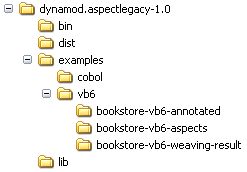
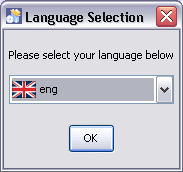
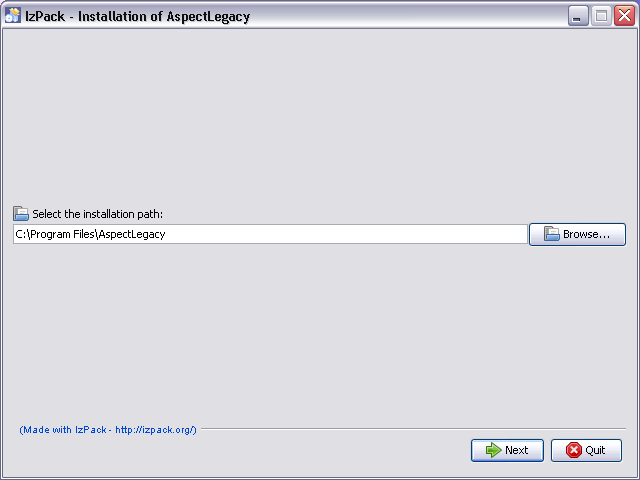
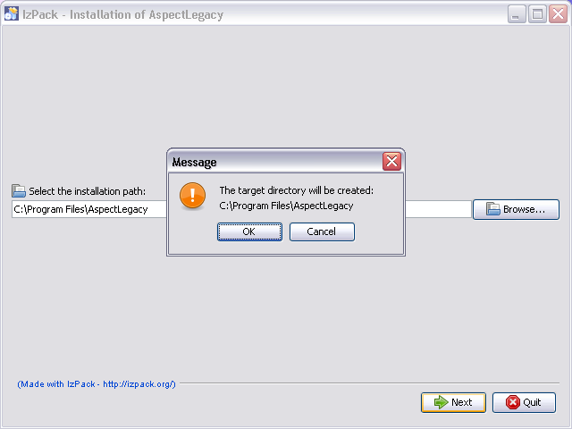
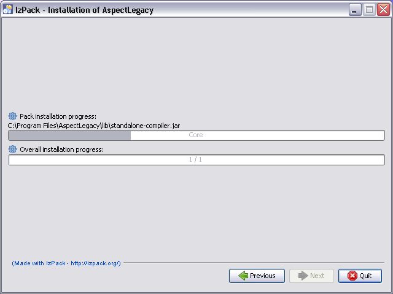
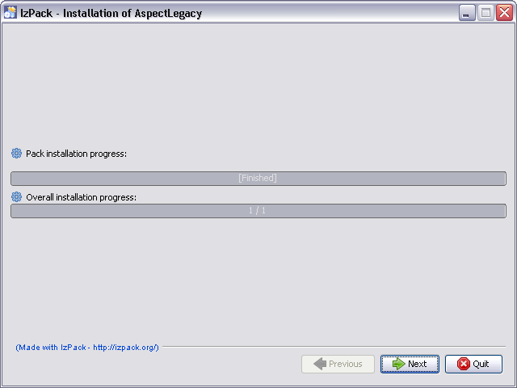
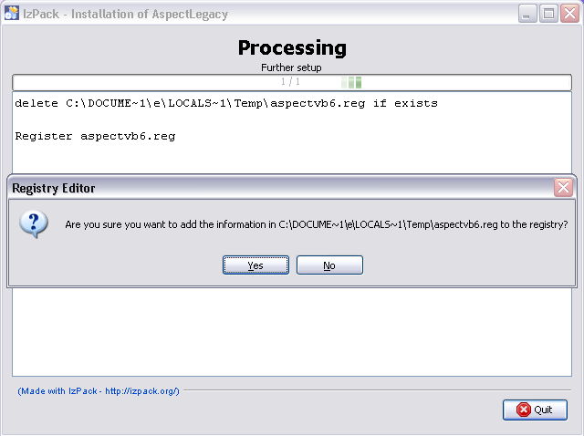
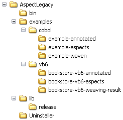

.. _instrumenting-software-vb-quickstart:

AspectLegacy Quick Start (Visual Basic 6)
=========================================

Table of Contents
^^^^^^^^^^^^^^^^^

1. `AspectLegacy Quick Start (Visual Basic
   6) <https://build.se.informatik.uni-kiel.de/DynaMod-tools/trac/wiki/dynamod.aspectlegacy/QuickStartVB6#AspectLegacyQuickStartVisualBasic6>`_

   1. `Introduction to the "Bookstore"
      Example <https://build.se.informatik.uni-kiel.de/DynaMod-tools/trac/wiki/dynamod.aspectlegacy/QuickStartVB6#IntroductiontotheBookstoreExample>`_
   2. `Installation <https://build.se.informatik.uni-kiel.de/DynaMod-tools/trac/wiki/dynamod.aspectlegacy/QuickStartVB6#Installation>`_
   3. `Weaving the "Bookstore"
      Example <https://build.se.informatik.uni-kiel.de/DynaMod-tools/trac/wiki/dynamod.aspectlegacy/QuickStartVB6#WeavingtheBookstoreExample>`_
   4. `Enhanced
      parameters <https://build.se.informatik.uni-kiel.de/DynaMod-tools/trac/wiki/dynamod.aspectlegacy/QuickStartVB6#Enhancedparameters>`_

This section describes the steps to be done for installing the
AspectLegacy tool. Note that the tool works under Linux as well as under
Windows XP/Vista/7, but for compiling any (woven) Visual Basic 6 source
code projects (.vbp), an installed version of the Visual Basic 6
integrated development environment (VB6 IDE) from Microsoft is required;
since the IDE is only available for Windows machines, VB6 code cannot be
compiled (but woven) under Linux.

Introduction to the "Bookstore" Example
---------------------------------------

The AspectLegacy distribution contains a simple "bookstore" example
code, written in Visual Basic 6 and divided into a main- and an
aspects-project. Depending on this example, the section below describes
how VB6 source files can be woven using the AspectLegacy tool, and how
the woven code can be compiled afterwards. The source code of the
bookstore main project contains several annotations referring to the
classes of the aspects projects. They will take effect after weaving, by
showing up dialogue windows whenever any of the annotated code positions
are being entered while runtime.

Installation
------------

It is assumed that you have already installed a VB6 IDE under Windows.

-  At first, you have to download the AspectLegacy binary distribution
   archive ("dynamod.aspectlegacy-1.0_binaries"), which is available
   `here <http://sourceforge.net/projects/dynamod/files/dynamod.aspectlegacy/1.0/>`_
   as a .zip- as well as a .tar.gz-file.

-  Extract the downloaded archive to an arbitrary location; the content
   will be placed into a (sub-)directory "dynamod.aspectlegacy-1.0"
   containing the following elements:

The content of the sub-folders is as follows:

========== ==========================================================
**Folder** **Content**
bin        Binary files (script files)
dist       Distribution files, contains the installer for the weaver.
examples   Examples for Cobol (futural feature) and Visual Basic 6.
lib        Required libraries.
========== ==========================================================

-  Start the installer by double-clicking the
   "dynamod.aspectlegacy-1.0-installer-WIN32.jar" file, which is located
   in the "dist"-directory.

-  Select the language to be used for the installation process:
   

Note that the language only affects the installation process, not the
aspect legacy application itself, which is always in english.

-  Afterwards, you will be asked for the target location of the
   application files:

The default directory is "C:\Program Files\AspectLegacy", which should
be preferably chosen. In case the target directory does not exist, its
creation has to be confirmed:

-  After the target directory has been confirmed, the installation
   process will start:

After the installation process finishes successfully, the "Next"-button
will be enabled:

-  Click the "Next" button to start the registration process. In this
   step, a key will be added to the registry, hence you are asked to
   confirm the modification:

Click the "Yes"-button for allowing the installer to add the necessary
key to the registry.

-  Finally, reboot your system to make the changes take effect (you
   might click the "Quit"-Button of the installer optionally before).

-  After your system has been rebooted, the "program files" folder
   contains a new sub-directory with the following structure, looking
   similar to the one of the distribution archive:

-  In the "bin" directory, you will find several batch-files,
   respectively the script files for starting the weaver application.

Weaving the "Bookstore" Example
-------------------------------

It is assumed that you have already performed the steps described in the
`Installation <https://build.se.informatik.uni-kiel.de/DynaMod-tools/trac/wiki/dynamod.aspectlegacy/QuickStartVB6#Installation>`_
section, so that an installed version of the AspectLegacy exists.

The following steps are required for starting the AspectLegacy
application:

1. Go to the "bin" directory which contains several batch-files (.bat),
   respectively those for starting the application. You might go there
   by using a command-line shell or a file manager, for example "Windows
   Explorer".

1. Do not execute the "avb6c.bat" file directly, since this is only the
   core file of all other batch-files contained in the "bin" directory;
   instead, you might execute one of the following batch-files:

-  The command

   avb6c-cmdl.bat

simply starts the application in a command-line shell. It prints a
usage-overview of the available parameters to standard output, if no
additional parameters are being passed.

-  The command

   avb6c-cmdl.bat -g

starts the application with its GUI. The GUI will be initialized with
default properties. The input-projects and the output-directory have to
be defined using the file dialogues of the GUI, and the weaving process
can be started by clicking the "Start"-button of the GUI (note that the
input projects and an output directory have to be defined therefore).
The command

avb6c-gui.bat

has been added for convenience reasons and is equivalent to this.

Now, we are going to weave the Visual Basic 6 projects of the
"Bookstore" example:

1. Go to the "examples" directory which contains the batch-files
   "avb6c-cmdl-example.bat" and "avb6c-gui-example". Again, you might go
   there by using a command-line shell or a file manager. The
   sub-folders

   examples\vb6\bookstore-vb6-annotated\\

and

examples\vb6\bookstore-vb6-aspects\\

contain the annotated and aspects-projects which we are going to weave
by example. Furthermore, the sub-folder

examples\vb6\bookstore-vb6-weaving-result\\

contains the result project as it is expected to look like after
weaving.

1. Execute one of the available ".bat"-files:

-  The command

   avb6c-cmdl-example.bat

starts the weaving process immediately (without GUI) for the example
projects and writes the weaving result to the "Temp" folder of the local
user directory. Any log-messages will be displayed as command-line
output. The output files will be located in the sub-folder

Temp\bookstore-vb6-weaving-result\\

of your user directory. Consequently, the full path of the result
project will be (in Windows) similar to

C:\Users\yourname\AppData\Local\Temp\bookstore-vb6-weaving-result\Bookstore.vbp

-  The command

   avb6c-gui-example.bat

starts the GUI with the example projects as default input projects and a
default output directory. The weaving process can be started immediately
by clicking the "Start"-button of the GUI, and any log-messages will be
displayed in the GUI-specific logging window.

Enhanced parameters
-------------------

This section contains an overview of additional parameters to be
optionally used.

-  The command

   avb6c-cmdl.bat -g gui.properties

starts the GUI of the weaver with the (optionally) given configuration
properties; this is for future purposes only.

-  The command

   avb6c-cmdl.bat -g gui.properties -w weaver.properties -l
   logging.properties

starts the GUI of the weaver as well as the command above, with
individual properties for weaving and logging; these properties might be
even passed, if no GUI is used.

