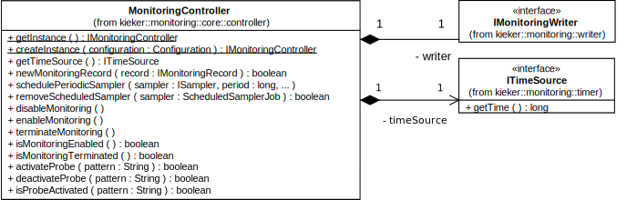

.. _java-monitoring-controller-api:

Java Monitoring Controller
==========================

The **MonitoringController** constructs and controls a 
**KiekerMonitoringPart** instance.

   Class diagram of the **MonitoringController** (including selected methods)

As depicted by the class diagram in the Figure above, it provides methods
for

- Creating **IMonitoringController** instances  (Section~\ref{sec:componentsMonitoring:monitoringController:factory}),
- Logging monitoring records with the configured monitoring writer (Section~\ref{sec:componentsMonitoring:monitoringController:logging}),
- Retrieving the current time via the configured time source (Section~\ref{sec:componentsMonitoring:monitoringController:getTime}),
- Scheduling and removing period samplers (Section~\ref{sec:componentsMonitoring:monitoringController:periodicSamplers}), 
- Controlling the monitoring state (Section~\ref{sec:componentsMonitoring:monitoringController:controState}), and
- Activating and deactivating probes at runtime \ref{sec:componentsMonitoring:monitoringController:adaptive}.

Creating **MonitoringController** Instances
-------------------------------------------

The **MonitoringController** provides two different static methods for
retrieving instances of **IMonitoringController**:

#. The method **MonitoringController.getInstance()** returns a singleton
   instance. As described in Section~\ref{sec:monitoring:configuration},
   the configuration is read from a properties file that has been passed
   to the JVM, is located in the classpath, or conforms to the default
   configuration (Appendix~\ref{sec:appdx:monitoringproperties}).
#. The method **MonitoringController.createInstance(Configuration config)**
   can be utilized to create an instance that is configured according to
   the passed **Configuration** object, as described in
   Section~\ref{sec:monitoring:configuration}.

Logging Monitoring Records
--------------------------

Monitoring records are sent to the configured monitoring writers by
passing these records, in form of **IMonitoringRecord** objects, to the
**MonitoringController**'s **newMonitoringRecord** method. Note, that
this is not the case if monitoring is disabled or terminated (Section~\ref{sec:componentsMonitoring:monitoringController:controState}).

Retrieving the Current Time and Using Custom Time Sources
~~~~~~~~~~~~~~~~~~~~~~~~~~~~~~~~~~~~~~~~~~~~~~~~~~~~~~~~~

The current time is maintained by a so-called time source. The **MonitoringController**'s method **getTimeSource** returns an
**ITimeSource** whose method **getTime** returns a timestamp in
nanoseconds. **Kieker**'s default time source, **SystemNanoTimer**,
returns the current system time as the number of nanoseconds elapsed
since 1 Jan 1970 00:00~UTC. The easiest way to use a custom time source
is to extend the **AbstractTimeSource** and to implement the method
**getTime()**. Custom time sources make sense, for example, in
simulations where not the current system time but the current simulation
time is relevant. The configuration needs to be adjusted to use a custom
time source class.

Scheduling and Removing Periodic Samplers
~~~~~~~~~~~~~~~~~~~~~~~~~~~~~~~~~~~~~~~~~

For certain applications, it is required to monitor runtime data
periodically, e.g., the utilization of system resources such as CPUs. 
For this purpose, **Kieker** supports special monitoring probes, called samplers. Samplers must implement the interface **ISampler** which
includes a single method **sample(IMonitoringController monitoringController)**
This method is called in periodic time steps, as specified by the **MonitoringController**'s registration function 
**schedulePeriodicSampler**. Periodic samplers can be stopped by 
calling the **MonitoringController**'s method **removeScheduledSampler**.

The Listing below shows the **sample** method of the
**MemSwapUsageSampler** which can be used to monitor memory and swap
usage employing the OSHI library <https://github.com/oshi/oshi>.

Likewise to other monitoring probes described in this userguide (e.g.,
:ref:`java-monitoring-probe`), it collects the data of interest
(lines 60--65), creates a monitoring record (lines 67--71), and passes
this monitoring record to the monitoring controller
(line 73). The available OSHI-based samplers for monitoring system-level
monitoring data, such as CPU and memory usage, are available in **kieker.monitoring.sampler.oshi**.

.. note::

  reference to probes JavaDoc or OSHI intro page

.. code-block:: java
   :linenos:
   :lineno-start: 52
   :emphasize-lines: 9,10,11,12,13,14,16,17,18,19,20,22

   @Override
   public void sample(final IMonitoringController monitoringCtr) {
      if (!monitoringCtr.isMonitoringEnabled() || 
          !monitoringCtr.isProbeActivated(SignatureFactory.createMemSwapSignature())) {
         return;
      }
      final GlobalMemory globalMemory = this.hardwareAbstractionLayer.getMemory();
      
      final long memoryTotal = globalMemory.getTotal();
      final long memoryAvailable = globalMemory.getAvailable();
      final long memoryUsed = memoryTotal - memoryAvailable;
      final long swapTotal = globalMemory.getSwapTotal();
      final long swapUsed = globalMemory.getSwapUsed();
      final long swapFree = swapTotal - swapUsed;
      
      final MemSwapUsageRecord r = new MemSwapUsageRecord(
         monitoringCtr.getTimeSource().getTime(),
         monitoringCtr.getHostname(),
         memoryTotal, memoryUsed, memoryAvailable,
         swapTotal, swapUsed, swapFree);
         
      monitoringCtr.newMonitoringRecord(r);
   }

Controlling the Monitoring State
~~~~~~~~~~~~~~~~~~~~~~~~~~~~~~~~

The **MonitoringController** provides methods to temporarily enable or
disable monitoring (**enableMonitoring**/**disableMonitoring**), as well
as to terminate monitoring permanently (**terminateMonitoring**).
The current state can be requested by calling the methods 
**isMonitoringEnabled** and **isMonitoringTerminated**. If monitoring is
not enabled (i.e., disabled or terminated), no monitoring records
retrieved via the method **newMonitoringRecord** are passed to the
monitoring writer. Also, probes should be passive or return immediately
with respect to the return value of the method **isMonitoringEnabled**.
Note, that once the **MonitoringController** is terminated, it cannot be
enabled later on.

Adaptive Monitoring
~~~~~~~~~~~~~~~~~~~

The **MonitoringController** provides an API to activate and deactivate
probes at runtime. By passing a method signature---e.g., 
``"public void Bookstore.getBook()"``---to the method **isProbeActivated**, probes can check whether or not monitoring for the method with the given
signature is active. 
Monitoring can be (de)activated for single signature *patterns*---e.g.,
``"public void Bookstore.*(..)"``--- via the methods **activateProbe**
and **deactivateProbe**. The current list of (de)activated patterns can
be obtained via the method **getProbePatternList**.
The entire list can be replaced using the method **setProbePatternList**.
Alternatively, a file with include and exclude patterns can be used.
This file can be polled in regular intervals. 
A default configuration file, including a description of the pattern
syntax, is provided by the file
``kieker.monitoring.adaptiveMonitoring.example.conf`` in the ``examples/`` directory of the binary release.

.. note::

   This section might be outdated and should be checked with the current
   implementation, as there are different ways to send information to
   the probe controller.

With the same mechanism arbitrary probes can be controlled. The syntax
is also included in the above file. For example, **Kieker**'s probes for
CPU and memory make use of this mechanism.

By default, **Kieker**'s adaptive monitoring feature is deactivated.
It can be enabled by setting the value of the configuration property 
``kieker.monitoring.adaptiveMonitoring.enabled`` in the
``\monitoringPropertiesFile`` file to *true*. Additional properties
to configure the adaptive monitoring are included in the file 
``kieker.monitoring.properties``, e.g., the location of the
aforementioned file with include/exclude patterns and the polling
interval for this file.
