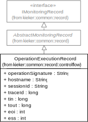

.. _gt-manual-monitoring-with-kieker:

Manual Monitoring with Kieker 
=============================

In this section, we explain the preparations for application monitoring,
the instrumentation of the application, and the actual monitoring.

.. note::
   In this example, the instrumentation is done manually. This means that
   the monitoring probe is implemented by mixing monitoring logic with
   business logic, which is often not desired since the resulting code is
   hard to maintain. Kieker includes probes based on AOP (aspect-oriented
   programming technology. However, to illustrate the instrumentation in
   detail, the quick start example uses manual instrumentation.

The first step is to copy the **Kieker** jar-file
``kieker-1.15-emf.jar`` to the lib/ directory of the example directory.
The file is located in the ``kieker-1.15/build/libs/`` directory of the
extracted **Kieker** archive (see download instructions). In the example
directory for this section, this file is already included, as
illustrated below.

-  ``examples/``

   -  ``userguide/``

      -  ``ch2–manual-instrumentation/``

         -  ``build/`` Directory for the Java class files
         -  ``lib/`` Directory for the required libraries

            -  ``kieker-1.15-SNAPSHOT-emf.jar``

         -  ``src/`` The directory for the source code files

The Java sources and pre-compiled binaries of the manually instrumented
Bookstore application described in this section can be found in
the\ ``examples/userguide/ch2-manual-instrumentation/``\ directory.

**Kieker** maintains monitoring data as so-called monitoring records.
Section 3.3 describes how to define and use custom monitoring record
types. The monitoring record type used in this example is an
*OperationExecutionRecord* which is included in the **Kieker**
distribution. The next figure shows the attributes which are relevant to
this example. The record type definition can be found here.

   
   Central event type classes in **Kieker** for Java

The attributes relevant to this part are *operationSignature* and
*hostname*, as well as *tin* and *tout* for the timestamps before and
after the call of the instrumented method. The following listing shows
the instrumentation of the ``Bookstore`` class and its method
``searchBook()``. In the lines 25 and 26, the monitoring controller is
instantiated. It provides the monitoring service for the
instrumentation.

.. code-block:: Java
	:linenos:
		
	private static final IMonitoringController MONITORING_CONTROLLER =
		MonitoringController.getInstance();
	
	private final Catalog catalog = new Catalog();
	private final CRM crm = new CRM(this.catalog);

	public void searchBook() {
		// 1.) Call Catalog.getBook() and log its entry and exit timestamps.
		final long tin = MONITORING_CONTROLLER.getTimeSource().getTime();
		this.catalog.getBook(false); // <-- the monitored execution
		final long tout = MONITORING_CONTROLLER.getTimeSource().getTime();
		final OperationExecutionRecord e = new OperationExecutionRecord(
			"public void " + this.catalog.getClass().getName() +
			".getBook(boolean)",
			OperationExecutionRecord.NO_SESSION_ID,
			OperationExecutionRecord.NO_TRACE_ID,
			tin, tout, "myHost",
			OperationExecutionRecord.NO_EOI_ESS,
			OperationExecutionRecord.NO_EOI_ESS);

		MONITORING_CONTROLLER.newMonitoringRecord(e);

		// 2.) Call the CRM catalog's getOffers() method (without monitoring).
		this.crm.getOffers();
	}

The lines 32 and 34 are used to determine the current time in
nanoseconds before and after the ``getBook()`` call. In lines 36 to 42,
a monitoring record for this measurement is created and initialized,
passing the method signature, the hostname, and the two time values as
arguments. Finally, the record is handed over to the monitoring
controller (line 43) which calls a monitoring writer to persist the
record. In this example, the filesystem writer is used -- **Kieker** uses
this writer by default when no other writer is specified, as detailed in
Section `3.5. In <http://3.5.In>`__ addition to the instrumentation in
the ``Bookstore`` class, the ``getOffers()`` method of
the ``CRM`` class is instrumented as well. Similar to the Listing
above, measurements are taken before and after the call of
the ``catalog``'s ``getBook()`` method, as shown in lines 36 and 38
of the Listing below. Not shown in the listing is the instantiation of
the monitoring controller.However, it is done in the same way as
illustrated above. Finally, a record is created (see lines 40–46) and
stored by calling the monitoring controller (see line 47).

.. todo::

   Fix section references

.. code-block:: Java
	:linenos:
	
	public void getOffers() {
		// 1.) Call Catalog.getBook() and log its entry and exit timestamps.
		final long tin = MONITORING_CONTROLLER.getTimeSource().getTime();
		this.catalog.getBook(false); // <-- the monitored execution
		final long tout = MONITORING_CONTROLLER.getTimeSource().getTime();
		final OperationExecutionRecord e = new OperationExecutionRecord(
			"public void " + this.catalog.getClass().getName() +
			".getBook(boolean)",
			OperationExecutionRecord.NO_SESSION_ID,
			OperationExecutionRecord.NO_TRACE_ID,
			tin, tout, "myHost",
			OperationExecutionRecord.NO_EOI_ESS,
			OperationExecutionRecord.NO_EOI_ESS);
		MONITORING_CONTROLLER.newMonitoringRecord(e);
	}

The next step after instrumenting the code is running the instrumented
application. Below we show the commands to compile and run the
application under UNIX-like systems and Windows. The expected working
directory is the base directory of this example,
i.e. ``examples/userguide/ch2-manual-instrumentation/``.

.. code:: shell
	
	javac src/kieker/examples/userguide/ch2bookstore/manual/∗.java \
		-classpath lib/kieker-1.15-SNAPSHOT-emf.jar -d build/
	
	java -classpath build/:lib/kieker-1.15-SNAPSHOT-emf.jar \
		kieker.examples.userguide.ch2bookstore.manual.BookstoreStarter

Under Windows it is necessary to separate the classpath elements by a
semicolon instead of a colon. Also, we recommend to use the Windows
shell ``cmd.exe`` for this tutorial since problems have been reported
for the Windows PowerShell. Also input each command on one line

.. code:: shell
	
	javac src\kieker\examples\userguide\ch2bookstore\manual\∗.java
		-classpath lib\kieker-1.15-SNAPSHOT-emf.jar -d build\
	
	java -classpath build\;lib\kieker-1.15-SNAPSHOT-emf.jar
		kieker.examples.userguide.ch2bookstore.manual.BookstoreStarter

If everything worked correctly, a new directory for the monitoring data
with a name similar to ``kieker-20120402-163314855-UTC-myHost-KIEKER-SINGLETON/``
is created (compare structure below). In **Kieker**'s default
configuration, the log directory can be found in the default temporary
directory: under UNIX-like systems, this is typically ``/tmp/``; check
the environment variables ``$TMPDIR`` or ``%temp%`` for the location
under MacOS or Windows respectively. The exact location of the created
monitoring log is reported in **Kieker**'s console output (see for
example Appendix H.1).

.. todo::

   Resolve this broken reference to the appendix.

The monitoring directory contains two types of files: ``.dat`` files
containing text representations of the monitoring records and a file
named\ ``kieker.map``\ which contains information on the types of
monitoring records used.

-  ``/tmp/``

   -  ``kieker-20130910-120352847-UTC-myHost-KIEKER-SINGLETON/``

      -  ``kieker.map``
      -  ``kieker-20120402-163314882-UTC–000-Thread-1.dat``

.. todo::

   Fix listing references.
   
The Listings 2.11 and 2.12 show example file contents.
The ``.dat``-file is saved in CSV format (Comma Separated Values) - in
this case, the values of a monitoring record are separated by
semicolons. To understand the ``.dat`` - file structure the semantics
have to be explained. For this quick start example only some of the
values are relevant. The first value ``$1`` indicates the record type.
The fourth value indicates the class and method which has been called.
And the seventh and eighth value are the start and end time of the
execution of the called method.

.. code::
  
  $0;1378814632852912850;1.8−SNAPSHOT;KIEKER−SINGLETON;myHost;1;false;0;NANOSECONDS;1
  $1;1378814632852360525;public void kieker.examples.userguide.ch2bookstore.manual.Catalog.getBook(boolean);<no−session−id>;−1;1378814632849896821;1378814632852105483;myHost;−1;−1

The second file is a simple mapping file referencing keys to monitoring
record types. In the mapping file the key ``$1`` is mapped to the type
of operation execution records which were used in the monitoring. The
key value corresponds to the key values in the ``.dat``-file.

.. code::
  
  $0=kieker.common.record.misc.KiekerMetadataRecord
  $1=kieker.common.record.controlflow.OperationExecutionRecord

By the end of this section, two Java classes of the Bookstore
application have been manually instrumented using *Kieker.Monitoring*
and at least one run of the instrumented application has been performed.
The resulting monitoring log, written to the ``.dat``-file in CSV
format, could already be used for analysis or visualization by any
spreadsheet or statistical tool. The next step in this tutorial is to
show how to process this monitoring data with *Kieker.Analysis.*
