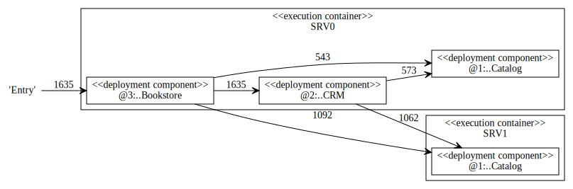
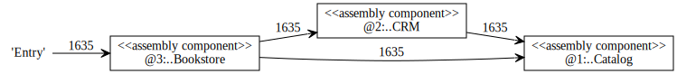
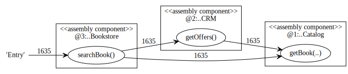
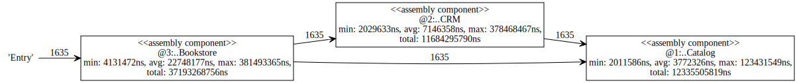

.. _gt-using-kieker-trace-analysis:

Using Kieker Trace-Analysis 
===========================

Kieker comes with a wide range of analysis stages which can be used to
analyze monitoring data. There is extensive documentation on how to
build tools with **Kieker** analysis in `Writing Tools and
Services <https://kieker-monitoring.atlassian.net/wiki/spaces/DOC/pages/290586640/Writing+Tools+and+Services>`__.
For this Getting Started chapter, we want to focus on using existing
tooling, specifically the *trace-analysis* tool.

Monitoring data collected by the previous steps contains trace
information based on ``OperationExecutionRecord``\ s that can be
analyzed and visualized with the **Kieker** *trace-analysis* tool which
is included in the **Kieker** binary distribution. The tool outputs dot
and pict files.

In order to use this tool, it is necessary to install two third-party
pro-grams:

.. note::
   1. **GraphViz** A graph visualization software which can be down-loaded
      from ``http://www.graphviz.org``
   2. **GNU PlotUtils** A set of tools for generating 2D plotgraphics which
      can be downloaded
      from ``http://www.gnu.org/software/plotutils/`` (for Linux) and
      from ``http://gnuwin32.sourceforge.net/packages/plotutils.htm`` (for
      Windows).
   3. **ps2pdf** The ``ps2pdf`` tool is used to convert ps files to pdf
      files.

Under Windows it is recommended to add the ``bin/`` directories of
both tools to the “path” environment variable. It is also possible that
the GNU PlotUtils are unable to process sequence diagrams. In this case
it is recommended to use the Cygwin port of PlotUtils.

Once both programs have been installed, the **Kieker**
``trace-analysis`` tool can be used. It can be found in the ``tools``
directory of the Kieker binary release. Unpack the
``trace-analysis-1.14.zip`` alongside the ``jpetstore-6`` directory.
Start scripts can then be found in
``trace-analysis-1.14/bin/trace-analysis`` (Unix) and
``trace-analysis-1.14/bin/trace-analysis.bat`` (Windows).
Non-parameterized calls of the scripts print all possible options on the
screen.The commands shown in Listings below generate a sequence diagram
as well as a call tree to an existing directory named ``out/``. The
monitoring data is assumed to be located in the logging directory, e.g.,
``kieker-20200615-130444-341575577055999-UTC--KIEKER/`` alongside the
``jpetstore-6`` directory.

Before executing the trace-analysis, you need to create the ``out/``
directory alongside the ``jpetstore-6`` directory.

Unix version

.. code:: shell
   
   trace-analysis-1.14/bin/trace-analysis -inputdirs
   trace-analysis-1.14/bin/trace-analysis \
      -inputdirs kieker-20200615-130444-341575577055999-UTC--KIEKER \
      -outputdirout/ \
      -plot-Deployment-Sequence-Diagrams–plot-Call-Trees–short-labels

Windows version

.. code:: shell
   
   trace-analysis-1.14/bin/trace-analysis.bat 
     -inputdirs kieker-20200615-130444-341575577055999-UTC--KIEKER
     -outputdir out\
     -plot-Deployment-Sequence-Diagrams–plot-Call-Trees–short-labels

The resulting contents of the ``out/`` directory should be similar to
the following tree:

-  ``out/``
-  ``deploymentSequenceDiagram-6120391893596504065.pic``
   -  ``callTree-6120391893596504065.dot``
   -  ``system-entities.html``

The ``.pic`` and ``.dot`` files can be converted into other formats,
such as ``.pdf``, by using the GraphViz and Plot Utils
tools ``dot`` and ``pic2plot``. Type the following to generate PDF
file from the graphics.

.. code:: shell
   
   dot callTree−6120391893596504065.dot -T pdf -o callTree.pdf
   pic2plot deploymentSequenceDiagram−6120391893596504065.pic-T pdf > sequenceDiagram.pdf

.. note::
   The scripts ``dotPic-fileConverter.sh`` and ``dotPic-fileConverter.bat``
   convert all ``.pic`` and ``.dot`` in a specified directory. The scripts
   can be found in the bin directory of the **Kieker** binary distribution.

Example Kieker Trace-Analysis Outputs
-------------------------------------

The examples presented in this section were generated based on the
monitoring data which can be found in the
directory ``examples/userguide/ch5-trace-monitoring-aspectj/testdata/kieker-20100830-082225522-UTC/``.
It consists of 1635 traces of the Bookstore application with
AspectJ-based instrumentation, as described in the `AspectJ
Instrumentation
Example <AspectJ-Instrumentation-Example.rst>`__. In order to
illustrate the visualization of distributed traces, the hostname of
the ``Catalog``'s method ``getBook`` was probabilistically changed to
a second hostname. The output can be found in the
directory ``examples/userguide/ch5-trace-monitoring-aspectj/testdata/kieker-20100830-082225522-UTC-example-plots/``.

.. todo::
   Fix reference to example.

Textual Trace and Equivalence Class Representations
~~~~~~~~~~~~~~~~~~~~~~~~~~~~~~~~~~~~~~~~~~~~~~~~~~~

Execution Traces
^^^^^^^^^^^^^^^^

Textual execution trace representations of valid/invalid traces are
written to an output file using the command-line options
``--print-Execution-Traces``\ and ``--print-invalid-Execution-Traces``.
The following listing shows the execution trace representation for the
valid trace . . . 6129.

.. code:: shell
   
   TraceId 6488138950668976129 (minTin=1283156498770302094 (Mon, 30 Aug
   2010 08:21:38.770 +0000 (UTC));
   
   maxTout=1283156498820012272 (Mon, 30 Aug 2010 08:21:38.820 +0000 (UTC));
   maxEss=2):
   
   <6488138950668976129[0,0] 1283156498770302094−1283156498820012272
   SRV0::@3:bookstoreTracing.Bookstore.searchBook N/A>
   
   <6488138950668976129[1,1] 1283156498770900902−1283156498773404399
   SRV1::@1:bookstoreTracing.Catalog.getBook N/A>
   
   <6488138950668976129[2,1] 1283156498817823953−1283156498820007367
   SRV0::@2:bookstoreTracing.CRM.getOffers N/A>
   
   <6488138950668976129[3,2] 1283156498817855493−1283156498819999771
   SRV1::@1:bookstoreTracing.Catalog.getBook N/A

Message Traces
^^^^^^^^^^^^^^

Textual message trace representations of valid traces are written to an
output file using the command-line option ``--print-Message-Traces``.
The listing below shows the message trace representation for the valid
trace . . . 6129.

Trace 6488138950668976129:

.. code:: shell
	
	<SYNC−CALL 1283156498770302094
	’Entry’−−>6488138950668976129[0,0]1283156498770302094−1283156498820012272
	SRV0::@3:bookstoreTracing.Bookstore.searchBook N/A>
	
	<SYNC−CALL 1283156498770900902 6488138950668976129[0,0]
	1283156498770302094−1283156498820012272SRV0::@3:bookstoreTracing.Bookstore.searchBook
	N/A−−>6488138950668976129[1,1]1283156498770900902−1283156498773404399
	SRV1::@1:bookstoreTracing.Catalog.getBook N/A>
	
	<SYNC−RPLY 1283156498773404399 6488138950668976129[1,1]
	1283156498770900902−1283156498773404399SRV1::@1:bookstoreTracing.Catalog.getBook
	N/A−−>6488138950668976129[0,0]1283156498770302094−1283156498820012272
	SRV0::@3:bookstoreTracing.Bookstore.searchBook N/A>
	
	<SYNC−CALL 1283156498817823953 6488138950668976129[0,0]
	1283156498770302094−1283156498820012272SRV0::@3:bookstoreTracing.Bookstore.searchBook
	N/A−−>6488138950668976129[2,1]1283156498817823953−1283156498820007367
	SRV0::@2:bookstoreTracing.CRM.getOffers N/A>
	
	<SYNC−CALL 1283156498817855493 6488138950668976129[2,1]
	1283156498817823953−1283156498820007367SRV0::@2:bookstoreTracing.CRM.getOffers
	N/A−−>6488138950668976129[3,2]1283156498817855493−1283156498819999771
	SRV1::@1:bookstoreTracing.Catalog.getBook N/A>
	
	<SYNC−RPLY 1283156498819999771 6488138950668976129[3,2]
	1283156498817855493−1283156498819999771SRV1::@1:bookstoreTracing.Catalog.getBook
	N/A−−>6488138950668976129[2,1]1283156498817823953−1283156498820007367
	SRV0::@2:bookstoreTracing.CRM.getOffers N/A>
	
	<SYNC−RPLY 1283156498820007367 6488138950668976129[2,1]
	1283156498817823953−1283156498820007367SRV0::@2:bookstoreTracing.CRM.getOffers
	N/A−−>6488138950668976129[0,0]1283156498770302094−1283156498820012272
	SRV0::@3:bookstoreTracing.Bookstore.searchBook N/A>
	
	<SYNC−RPLY 1283156498820012272 6488138950668976129[0,0]
	1283156498770302094−1283156498820012272SRV0::@3:bookstoreTracing.Bookstore.searchBook
	N/A−−>’Entry’>

Trace Equivalence Classes
^^^^^^^^^^^^^^^^^^^^^^^^^

Deployment/assembly-level trace equivalence classes are computed and
written to output files using the command-line options
``--print-Deployment-Equivalence-Classes`` and
``--print-Assembly-Equivalence-Classes``. The following listings show
the output generated for the monitoring data used in this section for
deployment and assembly, respectively.

**Deployment**

.. code:: shell
	
	Class 0 ; cardinality : 386; # executions: 4; representative :
	6488138950668976130; max. stack depth: 2
	Class 1 ; cardinality : 706; # executions: 4; representative :
	6488138950668976129; max. stack depth: 2
	Class 2 ; cardinality : 187; # executions: 4; representative :
	6488138950668976141; max. stack depth: 2
	Class 3 ; cardinality : 356; # executions: 4; representative :
	6488138950668976131; max. stack depth: 2

**Assembly**

.. code:: shell
	
	Class 0 ; cardinality : 1635; # executions: 4; representative :
	6488138950668976129; max. stack depth: 2

Sequence Diagrams
~~~~~~~~~~~~~~~~~

Deployment-Level Sequence Diagrams
^^^^^^^^^^^^^^^^^^^^^^^^^^^^^^^^^^

Deployment-level sequence diagrams are generated using the command-line
option ``--plot-Deployment-Sequence-Diagrams``. The following image
show these sequence diagrams for each deployment-level trace equivalence
representative (6129, 6130, 6131, 6141).

.. figure:: ../images/deploymentSequenceDiagram-6488138950668976129.svg
    :width: 300px
    :align: left
    :alt: Trace 6129
    :figclass: align-center

    Trace 6129

.. figure:: ../images/deploymentSequenceDiagram-6488138950668976130.svg
    :width: 300px
    :align: right
    :alt: Trace 6130
    :figclass: align-center

    Trace 6130

.. figure:: ../images/deploymentSequenceDiagram-6488138950668976131.svg
    :width: 300px
    :align: left
    :alt: Trace 6131
    :figclass: align-center

    Trace 6131

.. figure:: ../images/deploymentSequenceDiagram-6488138950668976141.svg
    :width: 300px
    :align: right
    :alt: Trace 6141
    :figclass: align-center

    Trace 6141

.. rst-class::  clear-both

Assembly-Level Sequence Diagrams
^^^^^^^^^^^^^^^^^^^^^^^^^^^^^^^^

Assembly-level sequence diagrams are generated using the command-line
option ``--plot-Assembly-Sequence-Diagrams``. The following figure shows
the sequence diagram for the assembly-level trace equivalence
representative.

    Trace 6129

Call Trees
~~~~~~~~~~

Trace Call Trees
^^^^^^^^^^^^^^^^

Trace call trees are generated using the command-line option
``--plot-Call-Trees``. The following figures show call trees for each
deployment-level trace equivalence representative.

.. figure:: ../images/callTree-all.svg
    :width: 600px
    :align: center
    :alt: Call Trees
    :figclass: align-center

    Call Trees

Aggregated Call Trees
^^^^^^^^^^^^^^^^^^^^^

Aggregated deployment/assembly-level call trees are generated using the
command-line options ``--plot-Aggregated-Deployment-Call-Tree``\ and
``--plot-Aggregated-Assembly-Call-Tree``. The following figures show
these aggregated call trees for the traces contained in the monitoring
data used in this section. The deployment call tree is on the left and
the right is the assembly call tree.

.. figure:: ../images/aggregatedDeploymentCallTree.svg
    :height: 400px
    :align: left
    :alt: Aggregated Deployment Call Tree
    :figclass: align-center

    Aggregated Assembly Call Tree

.. figure:: ../images/aggregatedAssemblyCallTree.svg
    :height: 400px
    :align: right
    :alt: Aggregated Assembly Call Tree
    :figclass: align-center

    Aggregated Assembly Call Tree

Dependency Graphs
~~~~~~~~~~~~~~~~~

Container Dependency Graphs
^^^^^^^^^^^^^^^^^^^^^^^^^^^

A container dependency graph is generated using the command-line option
``--plot-Container-Dependency-Graph``. The next figure shows the
container dependency graph for the monitoring data used in this section.

.. figure:: ../images/containerDependencyGraph.svg
    :width: 600px
    :align: center
    :alt: Container Dependency Graph
    :figclass: align-center
    
    Container Dependency Graph

Component Dependency Graphs
^^^^^^^^^^^^^^^^^^^^^^^^^^^

Deployment/assembly-level component dependency graphs are generated
using the command-line options
``--plot-Deployment-Component-Dependency-Graph``\ and
``--plot-Assembly-Component-Dependency-Graph``.

    
    Deployment Component Dependency Graph

    
    Assembly Component Dependency Graph

Operation Dependency Graphs
^^^^^^^^^^^^^^^^^^^^^^^^^^^

Deployment/assembly-level operation dependency graphs are generated
using the command-line options
``--plot-Deployment-Operation-Dependency-Graph`` and
``--plot-Assembly-Operation-Dependency-Graph``.

.. figure:: ../images/deploymentOperationDependencyGraph.svg
    :width: 600px
    :align: center
    :alt: Deployment Operation Dependency Graph
    :figclass: align-center
    
    Deployment Operation Dependency Graph

    
    Assembly Operation Dependency Graph

Response Times in Dependency Graphs
~~~~~~~~~~~~~~~~~~~~~~~~~~~~~~~~~~~

The afore-mentioned dependency graphs can also be decorated by the
response times,adding the minimum, the average, and the maximum response
times of the components.The decoration will be generated with one of the
additional ``responseTimes`` commandline parameters behind the
corresponding ``plot-`` command.

    
    Response Time - Assembly Component Dependency Graph

HTML Output of the System Model
~~~~~~~~~~~~~~~~~~~~~~~~~~~~~~~

The **Kieker** trace-analysis writes an HTML representation of the
system model reconstructed from the trace data to a
file\ ``system-entities.html``. The following screenshot depicts the
output rendered by a web browser.

.. figure:: ../images/system-entities-html-FFscrsh.png
    :width: 400px
    :align: center
    :alt: System Model Output
    :figclass: align-center
    
    System Model Output

