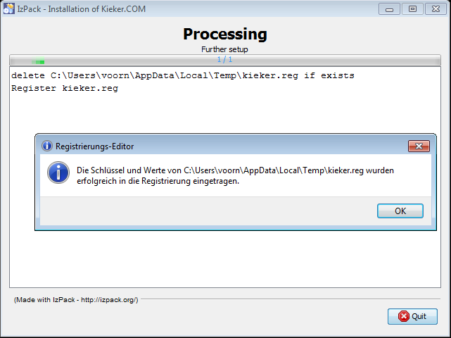
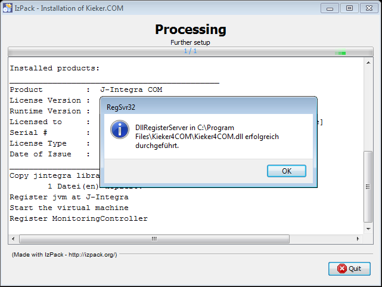
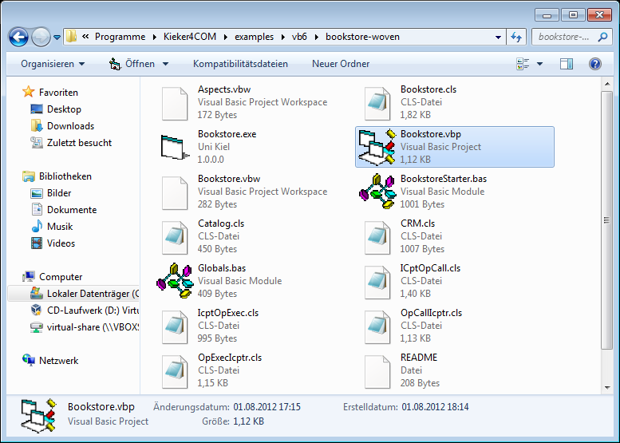
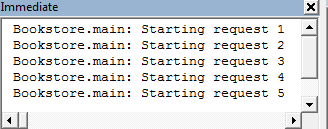
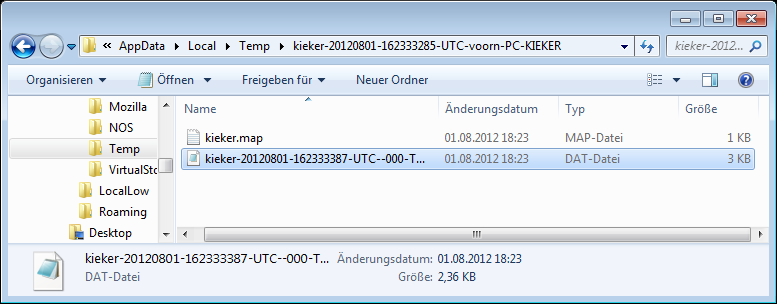
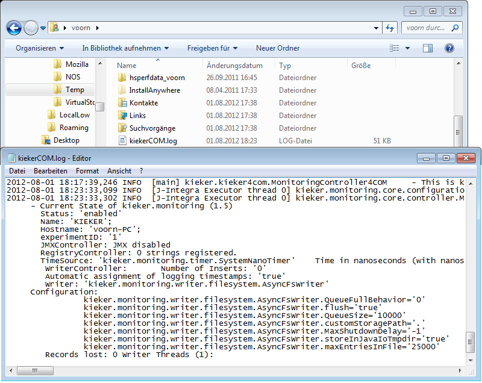
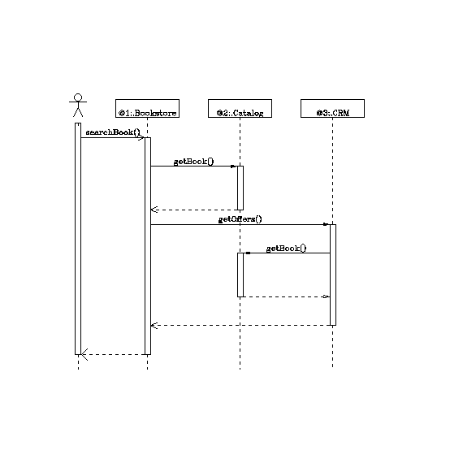
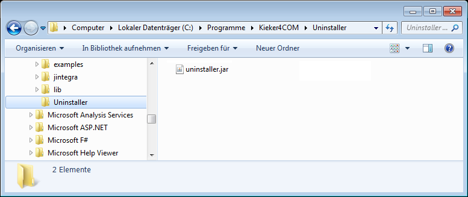
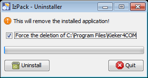

.. _instrumenting-software-kieker4com-installation:

Downloading, Installing, Using Kieker4COM 
=========================================

Downloading Kieker4COM
======================

-  Kieker4COM install archives are provided by the `nightly
   build <http://kieker.uni-kiel.de/jenkins/job/kieker4com-nightly-release/lastSuccessfulBuild/artifact/dist/release/>`_
-  The sources are available via the `Git repository
   kieker4com <https://build.se.informatik.uni-kiel.de/kieker/4com>`_

Installing Kieker4COM
=====================

**Note:** If you have just uninstalled a Kieker4COM version, you should
perform a restart before starting a new installation process!

1. Start installer
^^^^^^^^^^^^^^^^^^

Double-click on the downloaded file to start the installer.

You may need to allow the execution of the `Java Virtual
Machine <http://en.wikipedia.org/wiki/Java_Virtual_Machine>`_ required
for the installation program.

2. Language Selection
^^^^^^^^^^^^^^^^^^^^^

In the following dialog, you can select the language used in the
installation wizard. Currently, *German* and *English* are supported.

3. Installation Directory
^^^^^^^^^^^^^^^^^^^^^^^^^

The next step of the installation wizard lets you select the Kieker4COM
installation directory. Currently, our recommendation is to keep the
default value. In the following step, this step of creating the
installation directory requires an additional confirmation.

.. image:: ../../images/02-installdir.png

.. image:: ../../images/03-confirm-installdir.png

4. Installation of Kieker4COM Binaries
^^^^^^^^^^^^^^^^^^^^^^^^^^^^^^^^^^^^^^

After having confirmed the installation in the previous step, the
installer copies the Kieker4COM binaries to the selected directory.

.. image:: ../../images/04-copy-done.png

5. Selection of J-Integra COM License File
^^^^^^^^^^^^^^^^^^^^^^^^^^^^^^^^^^^^^^^^^^

Kieker4COM employs the ` J-Integra
COM <http://j-integra.intrinsyc.com/com.asp>`__ bridge for accessing the
Java-based Kieker monitoring component. The use of J-Integra COM
requires the installation of a ` JI COM Client
license <http://j-integra.intrinsyc.com/pricing.asp>`__.

Please select the file system location of the J-Integra COM license file
and confirm your selection.

.. image:: ../../images/05-select-license.png

6. Registration of Kieker4COM and Completion of Installation
^^^^^^^^^^^^^^^^^^^^^^^^^^^^^^^^^^^^^^^^^^^^^^^^^^^^^^^^^^^^

The next installation steps include the registration of the Kieker4COM
service in the Windows registry, the activation of the J-Integra COM
installation included with Kieker4COM, as well as an initial start of
the Kieker4COM service.

.. image:: ../../images/06-confirm-registry.png

.. image:: ../../images/09-success.png

Testing the Kieker4COM installation
===================================

The Kieker installation directory (%KIEKER_HOME%) contains a folder
called examples, which includes example projects instrumented in
different programming langugages. The directory examples\vb6\\ includes
examples for Visual Basic 6:

1. bookstore-annotated. A sample application which is enriched by
   AspectVB6 monitoring annotations which can be processed by the
   ` AspectLegacy <http://build.se.informatik.uni-kiel.de/DynaMod-tools/trac/>`__
   tool in order to weave `Kieker4COM monitoring
   aspects <http://kieker.uni-kiel.de/trac/wiki/Kieker4COM/Aspects>`__
   into the VB6 source code. See the Wiki page
   `KiekerCOM/Aspects <http://kieker.uni-kiel.de/trac/wiki/Kieker4COM/Aspects>`__
   for details.
2. bookstore-woven. This project is the result of the afore-mentioned
   process of weaving `Kieker4COM monitoring
   aspects <http://kieker.uni-kiel.de/trac/wiki/Kieker4COM/Aspects>`__
   into the source code of the bookstore-annotated project. We will use
   this project to test the Kieker4COM installation.

Generating Monitoring Data with the bookstore-woven example project
-------------------------------------------------------------------

The following figure shows the directory contents:

**UPDATE:** In newer versions, the example directory includes a
pre-compiled Bookstore.exe which can be started directly without the
need to import the VB6 project.

Import the project into the Visual Basic 6 IDE by opening the project
file Bookstore.vbp. Having started the example, the following debug
messages should appear in the *Immediate Window* (Ctrl+G):

The Kieker monitoring log is written to a directory named like
kieker-<timestamp> located in the %TEMP% directory (e.g.,
`C:\Users\voorn\AppData\Local\Temp`).

This Kieker file system monitoring log can now be processed by the
Kieker.TraceAnalysis tool, just like monitoring logs from Java or .NET
systems. An example monitoring log is contained in the
examples\vb6\monitoring-logs\ directory.

A KiekerCOM.log file with log messages is written to the %USERPROFILE%
directory.

The following diagrams were created by the following calls to the
Kieker.TraceAnalysis tool:

C:\Program Files\kieker4COM\bin>trace-analysis.bat -i
..\examples\vb6\monitoring-logs\kieker-20111017-152928614-UTC-voorn-PC-KIEKER
-o %TEMP% -p bla --plot-Assembly-Component-Dependency-Graph
--plot-Assembly-Component-Dependency-Graph

.. image:: ../../images/com-assemblyComponentDependencyGraph.png

Log messages are written to a kieker.log file in the %USERPROFILE%
directory.

Please refer to the ` Kieker
documentation <https://se.informatik.uni-kiel.de/kieker/documentation/>`__---particularly
the User Guide---to learn more about the usage of the
Kieker.TraceAnalysis tool.

Uninstalling Kieker4COM
=======================

1. Start Uninstaller
^^^^^^^^^^^^^^^^^^^^

Double-click on the *uninstaller.jar* file, to be found in the
*Uninstaller* sub-directory.

You may need to allow the execution of the ` Java Virtual
Machine <http://en.wikipedia.org/wiki/Java_Virtual_Machine>`__ required
for the uninstaller.

2. Confirm Uninstallation
^^^^^^^^^^^^^^^^^^^^^^^^^

In the upcoming wizard you should select the deletion of all files
included in the Kieker4COM installation directory and start the
uninstall process.

The uninstaller reports the successful deregistration of the Kieker4COM
service and the successfull completion of the uninstallation process.

.. image:: ../../images/94-uninstall-complete.png

3. Manual Deletion of the Kieker4COM Installation Directory
^^^^^^^^^^^^^^^^^^^^^^^^^^^^^^^^^^^^^^^^^^^^^^^^^^^^^^^^^^^

The uninstaller already removed most of the sub-directories and files
included in the Kieker4COM installation directory. As a last step,
you'll need to manually remove the kieker4COM directory from your
%ProgramFiles% (e.g., C:\Programme\kieker4COM) directory.

In some cases, the file *Kieker4COM* cannot be removed because it used.
Please perform a restart an repeat this manual deletion step.

Important note for Subsequent Reinstallation
^^^^^^^^^^^^^^^^^^^^^^^^^^^^^^^^^^^^^^^^^^^^

**You should restart your system after an uninstallation before starting
a subsequent installation.**

