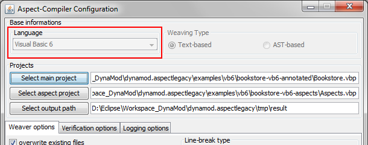
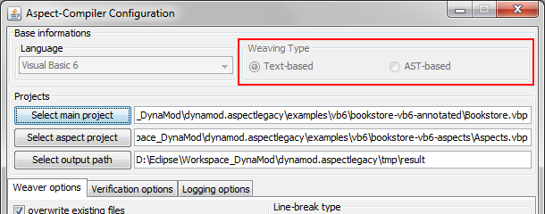
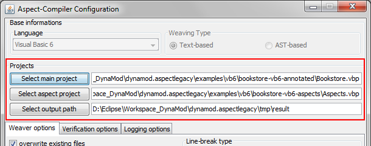
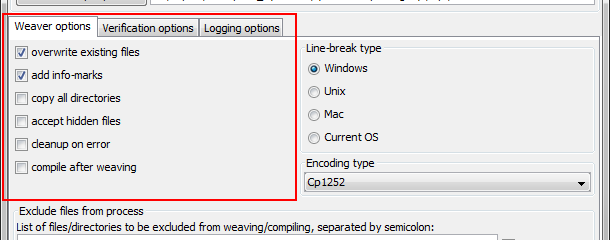
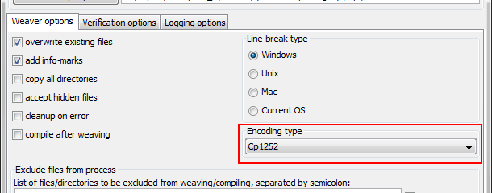
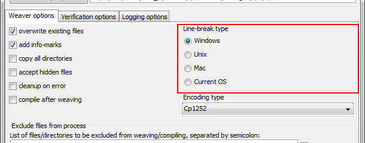
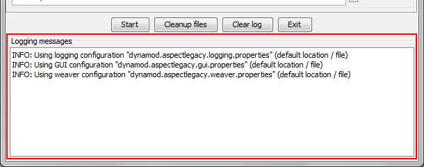

.. _instrumenting-software-vb-user-guide:

AspectLegacy (Visual Basic 6) User Guide 
========================================

Created by Andre van Hoorn, last modified on Oct 03, 2016

Usage
-----

Configuration management
~~~~~~~~~~~~~~~~~~~~~~~~

For simplifying the (re-)configuration of the weaver, its properties are
stored in a certain .properties-file for each component. The following
components are supported:

-  The graphical user interface (GUI),
-  The logging unit,
-  The weaver itself.

The properties of each component are hierarchically composed; whenever
the value of any property is requested, the properties-sources will be
searched in the following order:

#. User-defined properties file at a file system location (passed as a
   parameter to the weaver, see section `Command-line or
   GUI-based <https://build.se.informatik.uni-kiel.de/DynaMod-tools/trac/wiki/dynamod.aspectlegacy/UserGuide#Command-lineorGUI-based>`_);
   the file might contain any re-definitions of the available properties
   of sources 2.) or 3.).
#. User-defined properties file (with a predefined name), located in the
   working directory of the weaver; the file might contain any
   re-definitions of the available default properties of source 3.). The
   required names of the properties files to be located in the working
   directory are as follows:
   
   ======================================= ================================================================================
   dynamod.aspectlegacy.gui.properties     (default) GUI properties, for futural usage only.
   dynamod.aspectlegacy.logging.properties (default) logging properties for selection of the messages to be logged.
   dynamod.aspectlegacy.weaver.properties  (default) weaver properties for specification of general flags, selections etc.
   ======================================= ================================================================================
   
   Each of those files contains a set of key/value pairs, as they are
   used in Java resource bundles. A complete overview of the available
   properties is given by the files themselves, since all properties
   have been commented completely there (just have a look).

#. Default properties always present in the weaver.

Command-line or GUI-based
~~~~~~~~~~~~~~~~~~~~~~~~~

The weaver can be used as a command-line tool, or it can be started with
a graphical user interface (GUI) alternatively.

Starting the weaver from command-line is recommended, if only default
configuration properties shall be used. The weaving process itself will
be much faster, as there is no synchronization with the GUI -
particularly with the log-display - necessary. On the other hand, the
specification of input values to be passed as command-line parameters,
e.g. definition of input projects as well as the output directory, might
be prone to typos.

The GUI is useful for adjusting the default configuration to certain
cases. It provides an output window for log-messages and offers a much
more comfortable way of weaver configuration, for example, searching for
input/output paths via file dialogues or setting flags easily by
clicking their corresponding checkboxes. Furthermore, the GUI provides
an additional cleanup button for removing all lately generated output
files.

In both cases, the execution of the weaver requires the declaration of
certain parameters. Some of them are necessary, and some of them are
optional. The following parameters are available (denoted in short, long
format):

==================== =====================================================================================================================================================
-s,--source-project    Path to the source project to be woven (required, if GUI is disabled).
-a,--aspects-project   Path to the aspects project (required, if GUI is disabled).
-o,--output-dir        Path to the output directory for the woven project (required, if GUI is disabled).
-g,--gui               (Optional) usage of the graphical user interface (GUI); as an optional parameter, a properties-file might be passed for individual GUI-configuration.
-w,--weaver            (Optional) properties file for weaver configuration.
-l,--logging           (Optional) properties file for logging configuration.
==================== =====================================================================================================================================================

The paths can either be relative to the current weaver location or
absolute. The paths of the input projects might denote directories or
project-files, depending on the selected language.

Options
~~~~~~~

Line-break type
^^^^^^^^^^^^^^^

The line-break type determines the newline-format of the woven source
code. Since different operating systems have different character codes
that represent a newline, is might be useful (and in many cases
necessary) to select the newline format of the weaver output code
explicitly. Four types are available:

-  Windows ("\r\n")
-  Unix ("\n")
-  Mac ("\r")
-  Current OS

File encoding
^^^^^^^^^^^^^

The encoding-option provides the selection of the encoding which is used
for the source codes of a project to be woven. This might be necessary
for compiling the woven sources afterwards, since some compilers demand
a certain ISO-encoding of source code. For example, The Visual Basic 6
IDE gives error messages, in case the code to be compiled is not
ISO8859-1-encoded (Windows); if the weaver is started under Linux
(UTF-8), you will need to choose explicitly the correct encoding in that
case.

Exclude patterns for files (filename filter)
^^^^^^^^^^^^^^^^^^^^^^^^^^^^^^^^^^^^^^^^^^^^

If the source- and aspects-projects both contain any files of same names
(in the same relative sub-directory), a file conflict occurs. In those
cases, the weaving process will stop with a conflict message, as the
weaver does not know which file to take for the result output.

The filename filter supports exclude patterns for files of certain names
to avoid any of those conflicts. The patterns must be passed as a list
to the filter. Furthermore, the filter supports simple wildcards to
exclude all files with matching names from the weaving process.

The following Wildcards are available:

"?" indicates an arbitrary, single character.

"*" indicates a sequence of arbitrary characters.

Example: The line

"*.scc"; "textfile.txt"; "Image??.JPG"; "./parent/child"

indicates the exclusion of all files ending with ".scc" from the weaving
process, as well as files of name "textfile.txt" and files named
"Image??.JPG", with arbitrary characters at the question mark positions.
Furthermore, the file "child" contained in the sub-directory "parent"
will be excluded.

Wildcards are allowed in single file-/directory-names, but not in full
file-paths (yet?). The wildcards can be combined in an arbitrary way,
for example:

image?*.jpg

sorts out all .jpg-images with at least one character behind the "image"
token in their name, followed by an optional sequence of further
characters.

Verification options
^^^^^^^^^^^^^^^^^^^^

The following verification tests might be optionally done within the
weaving process:

-  Project directories are not allowed to be the same:

If enabled, the weaver will test on start whether the project
directories do not denote the same file system location. This test
should be always enabled, since the source- and aspects-projects
generally have to be located in different directories.

-  Files must be located in their base directories:

If enabled, the weaver will stop its work whenever a file to be accessed
is located neither in the source-project directory nor in the directory
of the aspects-project. This option is for futural purposes only.

-  Files of the same name are not allowed to be in both directories:

If enabled, the weaver ensures that the files to be woven or copied from
the source- and aspects-projects differ from each other regarding their
name. This test will be done for each file if and only if the file has
not been filtered out (see section `Exclude patterns for files (filename
filter) <https://build.se.informatik.uni-kiel.de/DynaMod-tools/trac/wiki/dynamod.aspectlegacy/UserGuide#Excludepatternsforfilesfilenamefilter>`_).

-  References have to be valid:

If enabled, the weaver will finally test whether all files of the
aspects-project, referenced by any annotations, have been successfully
copied to output directory.

Additional language-dependent tests might be necessary, for example, the
requirement of Visual Basic 6 project-files ending with ".vbp"; those
tests have to be done in the upper, language-dependent layer (see
section `Layered
architecture <https://build.se.informatik.uni-kiel.de/DynaMod-tools/trac/wiki/dynamod.aspectlegacy/DeveloperGuide#Layeredarchitecture>`_
of the `Developer
Guide <https://build.se.informatik.uni-kiel.de/DynaMod-tools/trac/wiki/dynamod.aspectlegacy/DeveloperGuide>`_).

Weaver options
^^^^^^^^^^^^^^

The following weaver options are available:

-  Overwrite output files:

If enabled, existing files located in the output directory will be
overwritten with files of same name. If disabled, the weaver will stop
its work in case a conflict with an existing file occurs.

-  Add info-marks:

If enabled, informational comments will be inserted above each
transformed code-block.

-  Copy all directories:

If enabled, (possibly existing) empty directories will be copied from
the source projects to the output directory. If disabled, empty
directories will be ignored.

-  Accept hidden files:

If enabled, hidden files will be included to the weaving process.

-  Clean-up on error:

If enabled, all created files will be deleted immediately after weaving
has failed. If disabled, the created (but possibly incomplete or
corrupt) files will be left in the output directory.

-  Compile after weaving:

If enabled, the result source codes written to the output directory will
be compiled immediately after weaving; external compilers or IDEs might
be required for this step.

Logging options
^^^^^^^^^^^^^^^

The following logging options are available:

-  Log compiler messages:

Enables the logging of informations submitted by the compiler unit,
whenever the resulting source code is going to be compiled.

-  Log weaver file-access messages:

Enables the logging of informations submitted by the weaver, whenever it
is going to copy or modify a file.

-  Log verification messages:

Enables the logging of informations submitted by the verification unit,
whenever a verification test is going to be done.

-  Log code-transformation messages:

Enables the logging of informations submitted by the code-transformation
unit, whenever an annotation is going to be transformed, variables are
going to be inserted etc.

-  Log clean-up messages:

Enables the logging of informations submitted by the clean-up unit,
whenever a file or directory is going to be deleted, or even if one
cannot be deleted.

The Graphical User Interface (GUI)
==================================

Overview
~~~~~~~~

When the weaver application is started with the "-g" parameter (see the
`Quickstart for Visual Basic
6 <https://build.se.informatik.uni-kiel.de/DynaMod-tools/trac/wiki/dynamod.aspectlegacy/QuickStartVB6>`_),
the following configuration window will be displayed:

.. image:: ../../images/weaver-gui.png

The initial settings will be in accordance with the configuration
properties, as they are defined by default or transmitted by the user
(see section `Configuration
management <https://build.se.informatik.uni-kiel.de/DynaMod-tools/trac/wiki/dynamod.aspectlegacy/UserGuide#Configurationmanagement>`__).

The GUI has a "top-down" design. That is, the base settings (considered
language, text- or AST-based weaving type, location of project files in
the file system) have to be configured in the upper part of the GUI,
before the possibly language- and weaving type-specific weaver-,
verification- and logging-options should be set, as well as further
options in the middle part. Below the options part, a control panel
contains buttons for starting and stopping the weaving process, as well
as cleaning up files or exiting the application. Finally, the bottom
part of the GUI contains a log-window for showing all information
generated by the weaver.

Base settings
~~~~~~~~~~~~~

The base settings need to be initialized with values for the following:

-  Language (to be considered for weaving, e.g. Visual Basic 6, COBOL,
   ...)
-  Weaving type (text- or AST-based)
-  Projects (respectively their locations in the file system)

Language
^^^^^^^^

For setting the language, a combo-box is provided, which contains all
languages supported by the weaver:

There must be at least one supported language available; if no further
languages are supported, the combo-box is disabled, and the only
supported language will be selected automatically.

Weaving type
^^^^^^^^^^^^

The weaving-type must be selected by clicking the related radio button;
currently, only text-based weaving is available, so this is for futural
usage only:

Projects
^^^^^^^^

For defining the locations of the projects within the file system, the
GUI provides file-choosers, which will be shown whenever one of the
"Select"-buttons is being clicked:

Some language like Visual Basic 6 need project-files, other languages do
not. It depends on the selected language whether a project-file or a
project directory must be determined.

Options
~~~~~~~

The options need to be initialized with values for the following:

-  Weaver options
-  Verification Options
-  Logging options

Since all of these option values are boolean, the related part of the
GUI contains a tabbed overview, with a tab for each option group,
supporting check-boxes for setting the values easily:

Furthermore, the options panel provides input masks for the encoding
type as well as for the line-break type to be used:

Finally, an input field for exclude file patterns is included (see
section `Exclude patterns for files (filename
filter) <https://build.se.informatik.uni-kiel.de/DynaMod-tools/trac/wiki/dynamod.aspectlegacy/UserGuide#Excludepatternsforfilesfilenamefilter>`_):

.. image:: ../../images/aspect-compiler-exclude-files.png

Control Panel
~~~~~~~~~~~~~

The control panel holds the control for all processes to be started or
stopped:

.. image:: ../../images/aspect-compiler-start.png

The following options are available:

=============== =====================================================================================================================================================
*Start*           - Start the weaving process.
*Cleanup files*   - Delete all newly created files/directories of the latest weaving-process; this will not delete any files/directories, which existed already before.
*Clear log*       - Clear the logging display (see section Logging window).
*Exit*            - Quit application.
=============== =====================================================================================================================================================

Logging window
~~~~~~~~~~~~~~

The logging window displays the information generated by any running
task of the weaver:

The content will be displayed multi-coloured, whereas the colours are
assigned as follows:

=========== ==============================================================================
*Black*     - General informations (e.g. confirmation message for a finished process).
*Light red* - Fatal errors (whenever an exception makes the weaver stopping an operation).
=========== ==============================================================================

Optional log-messages (see section `Logging
options <https://build.se.informatik.uni-kiel.de/DynaMod-tools/trac/wiki/dynamod.aspectlegacy/UserGuide#Loggingoptions>`_):

============ ===============================
*Dark red*   - Clean-up messages.
*Green*      - Compiler messages.
*Purple*     - Verification messages.
*Dark blue*  - Code-transformation messages.
*Light blue* - Weaver file-access messages.
============ ===============================

Limitations / Future Work
-------------------------

As a futural feature, weaving might be done text-based or AST-based (see
section `Weaving
type <https://build.se.informatik.uni-kiel.de/DynaMod-tools/trac/wiki/dynamod.aspectlegacy/UserGuide#Weavingtype>`__)).
The following section describes the main differences between both types.

Text-based weaving
~~~~~~~~~~~~~~~~~~

In the text-based weaving mode, the weaver will scan the source code
line-by-line and generate the transformed code "on the fly", without
syntax parsing. Syntax analysis is restricted to single lines, as they
are read while weaving.

AST-based weaving (futural feature)
~~~~~~~~~~~~~~~~~~~~~~~~~~~~~~~~~~~

In case AST-based weaving is selected, the source code of the input
projects will be parsed for generation of an abstract syntax tree. This
enables the detection of multiple-rows-comments and consequently the
detection of line-breaks, GOTOs etc.

Text-based weaving vs. AST-based weaving
^^^^^^^^^^^^^^^^^^^^^^^^^^^^^^^^^^^^^^^^

Text-based weaving is strongly restricted, since the source code is
considered only as plain text. There is no extensive analysis of
syntax/semantics, hence even the partial analysis of the source code is
difficult or not possible. For example, in languages like C/C++ or Java,
where comments might be nested or be wrapped over several lines, no
certain conclusion can be drawn about a single text line (e.g. whether a
certain line belongs to a wrapping comment, even if the statement itself
seems to be a command).

Consequently, text-based weaving should be primarily used for "simple"
languages, particularly for those which allow exclusively
single-line-comments (e.g. COBOL).

AST-based weaving should be used to ensure that the source code is
parsed correctly, for the ability to detect "complex" syntactical
constructs split on multiple lines (comments, split commands etc.).

