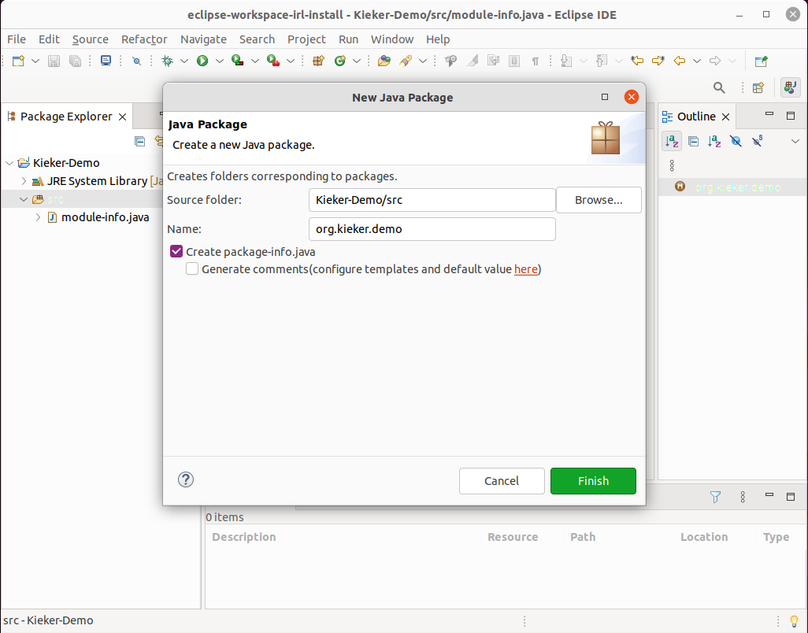
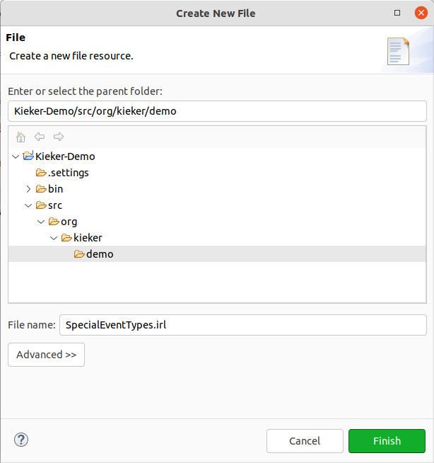
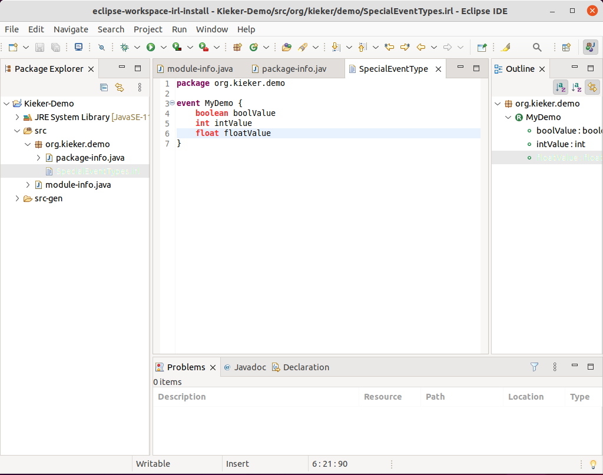
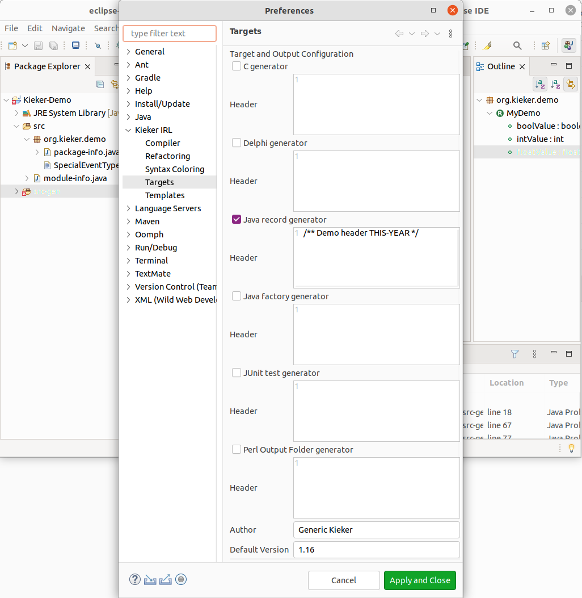

.. _kieker-tools-irl-how-to-setup-the-irl-in-eclipse:

How to Setup the IRL in Eclipse
===============================

In case you have not installed Eclipse and the IRL in Eclipse, please follow
ref:`tutorials-how-to-install-the-irl-in-eclipse`. In this tutorial we setup
the IRL in an Eclipse Java project. In case you want to use Maven or Gradle,
this can be done similarly. However, the inclusion the Kieker dependency
differs.

In case you have not started Eclipse, please do so.

Click in the menu on *File* > *New* > *Java Project* to create a new Java
Project.

.. image:: images/basic-java-project-with-irl/create-java-project.png

Give the project a *project name* and click on *Finish*. In this tutorial, we
call the Project Kieker-Demo, but of course you can give your project any other
name.

Eclipse will create a basic Java Project without any content beside a
`module-info.java` (depending on the used Java version).

Next we have to create a package for our files and then create an IRL file.
First, click on *File* > *New* > *Package*.

Here, we create a package `org.kieker.demo` typing this in the name field. You
can also check the *Create package-info.java* checkbox. Finally click on
*Finish*.

.. image:: images/basic-java-project-with-irl/show-package.png

This creates a `package-info.java` file in a package named *org.kieker-demo*.
Now we can create a IRL file in this package. Lets name it `SpecialEventType.irl`.
You can give your file any name, but make sure it has the ending irl.
To create a simple file click on *File* > *New* > *File* and enter a filename.

Eclipse may ask you whether you want to *Configure Xtext* with
*Do you want to convert Kieker-Demo to an Xtext project?*. In that case,
click on *Yes*, we definitely need to add the Xtext nature to the project.

.. image:: images/basic-java-project-with-irl/configure-xtext.png

The editor depicts the empty file `SpecialEventType.irl`. First, add the
*package* and the package name. Then start creating an event type.
Therefore, entrer *event* followed by the name for the event type. It is custom
to use Java camel case for the event type name. After the name add curly braces.

Now add some attributes to the event, by entring a type name followed by the 
attribute name. Legal types are all types known to Java, i.e., boolean, int,
byte, float, double, string, short, char and any enumeration defined within the
IRL.

The editor provides context help, but beside that nothing happens. This is 
because we have not yet activated a generator. To do so click on the menu 
*Window* > *Preferences*. This opens the preferences window. Select *Kieker IRL*
in the list on the left.

.. image:: images/basic-java-project-with-irl/kieker-preferences.png

Now open that preferences group by *double-click* no it should show a list of
entries. For us are only compiler and targets relevant.

Click on *Compiler*.

.. image:: images/basic-java-project-with-irl/kieker-preferences-compiler-tab.png

The entry *compiler is activated* should be checked. Below are several output
folders listed. Open the one named *Java record output folder*. It should show
a directory as `./src-gen/java`. This is where the IRL generator will put its
output for Java source code. You can also have a look at the
*Java factory output folder*.

Next, click on *Targets*.

This lists a set of outputs for different progamming languages. Check the 
checkboxes for *Java record generator* and *Java factory generator*. You may
also add a standard header that will be prepended to all generated files.
Here we added a short Java comment with a placeholder THIS-YEAR in uppercase
letters. The placeholder will be replaced by the current year.

At the bottom three parameter should be set.

- *Author* refers to the author being added in the Java code in case no author
  has been specified with the event type.
- *Default Version* refers to the version to be added to the Java code in case
  no version has been specified with the event type. The default is usually the
  current Kieker version.
- *Target Version* refers to the version of Kieker you are intending to use.
  As the Kieker API has changed in the past, it is important that you specify
  the correct Kieker version, e.g., 1.15.

Click on *Apply and Close*

Now automatically the generator starts and produces the Java version of the
event type.

Note that now there is a *src-gen* directory. Open it. It contains a
subdirectory called *java* which contains the generated code and package
structure. To include it into the build path, right-click on *src-gen/java* and
select *Build Path* > *Use as source Folder*. This adds the *java* directory
to the source directories. The Java compiler automatially compiles the content.
however, we have not added the Kieker library. Thus, this will generate some 
errors.

For a plain Java project, we have to add dependenices manually. Create within
Eclipse in the project a library directory *lib* with *File* > *New* > *Folder*.
Name the folder *lib*.

On the file system copy the Kieker library jar, e.g., `kieker-1.15-SNAPSHOT.jar`
to the *lib* directory. Use therefore either command line or your operating
systems copy functionality.

In Eclipse press F5 to refresh the project content. You may now see the jar
file in the *lib* directory. Right-click on the jar file and add it to the
build path.

You may need to trigger a rebuild with menu option *Project* > *Clean...* to
clean and then build the code.

Finally, you may inspect the generated code as shown in the image below.

.. image:: images/basic-java-project-with-irl/generated-code.png

