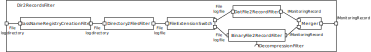
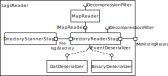

.. _technical-details-java-reader-receive-events-from-log-files:

Receive Events from Log Files 
=============================

.. todo::
  
  We might want to remove the old teetime file reader filters, as they
  are no longer used.

The old file reading stages setup in Teetime is rather complicated, uses
deprecated Kieker API and has a bad separation of concern, e.g.,
decompression is part of the binary log file reader and not a general
property of file reading. The following figure depicts this reading
setup.

To overcome the limitations and reduce complexity the new Kieker reader
API uses the depicted ``LogsReaderCompositeStage`` architecture. It
provides a generic Kieker reader complementing the capabilities of the
:ref:`technical-details-java-reader-receive-events-from-log-files`.
The image below depicts the new Teetime-filters providing log file reading.

The \ ``LogsReaderCompositeStage`` comprises of two stages
``DirectoryScannerStage`` and ``DirectoryReaderStage``, where the first
scans directories for Kieker logs and provides directories to the second
stage, and the second stage processes each log directory.

DirectoryScannerStage
---------------------

This stage scans a list of directories for Kieker log directories. They
are identified by the ``kieker.map`` file.

Configuration Options
~~~~~~~~~~~~~~~~~~~~~

none

DirectoryReaderStage
--------------------

Presently, Kieker log directories consist of a ``kieker.map`` file and
one or more ``kieker-*`` log files containing one or more serialized
events. Depending on their extension the files can be compressed in
different formats and they can be in binary or UFT-8 text format.
TAbstractEventDeserializerhey also could be in other formats, but this
is currently not supported by Kieker directly. The general workflow for
reading Kieker logs is to read the ``kieker.map`` file and then the
other log files. The map-file contains a mapping between ids and text,
where some entries are used to describe Kieker event (record) class
names and assign them ids used in the serialization.

As depicted in the figure above, the ``DirectoryReaderStage`` uses a map
reader to read in map files. Currently there is only a text map reader.
The map reader can utilize an ``IDecompressionFilter`` to read
compressed map-files. The filter is inserted into the Java IO stream and
should not be confused with Teetime stages.

After the map files are read, the ``DirectoryReaderStage`` starts
reading all log files in chronological order. Depending on their
extension, the stage first decompresses the data stream and then
utilizes a ``IEventDeserializer``. The deserializers can support a wide
range of formats. However, Kieker ships currently with a
``DatEventDeserializer`` and a ``BinaryEventDeserializer`` supporting
the two formats generated by the
:ref:`technical-details-java-reader-receive-events-from-log-files`. The filter
automatically determines which file formats have been used based on file
suffixes.

Configuration Options
~~~~~~~~~~~~~~~~~~~~~

none

AbstractEventDeserializer
-------------------------

The AbstractEventDeserializer is the parent class for all
IEventDeserializers. It provides common configuration options for the
deserializers.

Configuration Options
~~~~~~~~~~~~~~~~~~~~~

-  kieker.analysisteetime.plugin.reader.filesystem.AbstractEventDeserializer.bufferSize
   = size of the buffer in bytes (default 10240)

