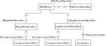

.. _technical-details-java-writer-file-writer:

File Writer 
===========

The file writer is a highly configurable component of Kieker. It allows
to use different map file and log file formats which can both be
compressed using a compression filter. Furthermore, different log file
pool strategies can be used, i.e., a user can collect all information or
use a log rotation scheme where the amount of space used by logs is
limited.

File Writer Configuration
-------------------------

The new FileWriter uses the IValueSerializer API to serialize files. It
is available since Kieker 1.14. Like the old file writers, it comes with
a wide range of settings. It usually writes two files. One containing a
map of strings to ids and one logfile.

To use the new FileWriter set

``kieker.monitoring.writer=kieker.monitoring.writer.FileWriter``

in your ``kieker.monitoring.properties`` file.
In order to use a custom directory, set ``customStoragePath`` to a
existing directory. Kieker will then write its log folders into this
directory.

``kieker.monitoring.writer.filesystem.FileWriter.customStoragePath=``

The FileWriter uses UTF-8 as default char set. However, you may want to
specify another charset with

``kieker.monitoring.writer.filesystem.FileWriter.charsetName=UTF-8``

As host file systems have limits on file length and to avoid losing all
data when the log is corrupted, you can limit the maximal number of
entries (events) per created file. The value must be greater than zero.

``kieker.monitoring.writer.filesystem.FileWriter.maxEntriesInFile=25000``

The maximal file size of the generated monitoring log. Older files will
be deleted if this file size is exceeded. Given in MiB. **Note:** At
least one file will always remain, regardless of size! Use -1 to ignore
this functionality.

``kieker.monitoring.writer.filesystem.FileWriter.maxLogSize=-1``

The maximal number of log files generated. Older files will be deleted
if this number is exceeded. At least one file will always remain,
regardless of size! Use -1 to ignore this functionality.

``kieker.monitoring.writer.filesystem.FileWriter.maxLogFiles=-1``

As mentioned before, the FileWriter writes a map of all strings to a map
file. This is usually done by the TextMapFileHandler, which is the
default. You may choose another map file handler.

``kieker.monitoring.writer.filesystem.FileWriter.mapFileHandler=kieker.monitoring.writer.filesystem.TextMapFileHandler``

When flushing is disabled, it could require a lot of events before
finally any writing to the map file is done. In case of long running
observations, this is the desired behavior. However, in shorter
experiments and in cases when the application crashes, it is helpful to
ensure all map entries have been written as soon as possible. To force
flushing on the the map file, set the following property to true.

``kieker.monitoring.writer.filesystem.TextMapFileHandler.flush=true``

As map files can become quite large, you may want to compress the output
of the TextMapFileHandler (compression not supported yet)

``kieker.monitoring.writer.filesystem.TextMapFileHandler.compression=kieker.monitoring.writer.filesystem.compression.NoneCompressionFilter``

Log file pool handler manages when files are written, how they are named
and when they are removed. The default ``RotatingLogFilePoolHandler``
which supports a upper limit of log files which are kept.

kieker.monitoring.writer.filesystem.FileWriter.logFilePoolHandler=kieker.monitoring.writer.filesystem.RotatingLogFilePoolHandler

The log stream handler writes the text output. Default is the
TextLogStreamHandler (text serialization in standard Kieker format)

``kieker.monitoring.writer.filesystem.FileWriter.logStreamHandler=kieker.monitoring.writer.filesystem.TextLogStreamHandler``

Alternatively, you may use the BinaryLogStreamHandler which serializes
the data in binary format.

``kieker.monitoring.writer.filesystem.FileWriter.logStreamHandler=kieker.monitoring.writer.filesystem.BinaryLogStreamHandler``

You may want to write your own LogStreamHandler, e.g., to support JSON
as output format.

When flushing is disabled, it could require a lot of events before
finally any writing to the log file(s) is done. To force flushing on the
set the following parameter.

``kieker.monitoring.writer.filesystem.FileWriter.flush=false``

When flushing is disabled, records are buffered in memory before
written. This setting configures the size of the used buffer in

``bytes.kieker.monitoring.writer.filesystem.FileWriter.bufferSize=8192``

When compression is enabled, each log file is written as zipped binary
file.

``kieker.monitoring.writer.filesystem.FileWriter.compression=kieker.monitoring.writer.filesystem.compression.NoneCompressionFilter``

Depending on the libraries used alongside Kieker, you can user ZIP, GZIP
and XZ compression. The corresponding classes are:

-  ``NoneCompressionFilter`` no compression
-  ``GZipCompressionFilter``
-  ``XZCompressionFilter``
-  ``ZipCompressionFilter``

You can write your own compression filter utilizing the
``ICompressionFilter`` interface.

