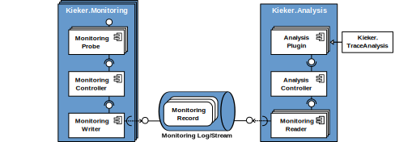

Documentation 
=============

**Kieker** is a Java-based application performance monitoring and
dynamic software analysis framework. Monitoring adapters for other
platforms, such as C, C++, Visual Basic~6~(VB6), .NET, and COBOL, exist
as well
(`Contact <http://kieker-monitoring.net/support/%7D%7BContact>`__ us
directly if you are interested in Kieker support for other platforms).

The figure below the framework's composition based on the two main
components *KiekerMonitoringPart* and *KiekerAnalysisPart*.

- The *KiekerMonitoringPart* component is responsible for program
  instrumentation, data collection, and logging. Its core is the
  *MonitoringController*.
- The component *KiekerAnalysisPart* is responsible for reading,
  analyzing, and visualizing the monitoring data. Its core is the
  *AnalysisController* which manages the life-cycle of the
  pipe-and-filter architecture of analysis plugins, including monitoring
  readers and analysis filters.

Please note that older programs might use a *AnalysisController* setup
while new analyses and tools reply on :ref:`architecture-java-analysis-and-tools-api`.

-  In case you want to learn how to apply Kieker to a Java application,
   you find an tutorial under :ref:`getting-started`.
-  For more advanced uses you may consult :ref:`tutorials`
-  All tools are documented under :ref:`kieker-tools`
-  More documentation and API and other programming languages can be
   found below

Table of Contents
-----------------

-  :ref:`getting-started`
-  :ref:`tutorials`
-  :ref:`instrumenting-software`
-  :ref:`analyzing-monitoring-data`
-  :ref:`kieker-tools`
-  :ref:`developing-with-kieker`
-  :ref:`extending-kieker`
-  :ref:`architecture` 
-  :ref:`lectures`
-  :ref:`related-work`

.. toctree::
