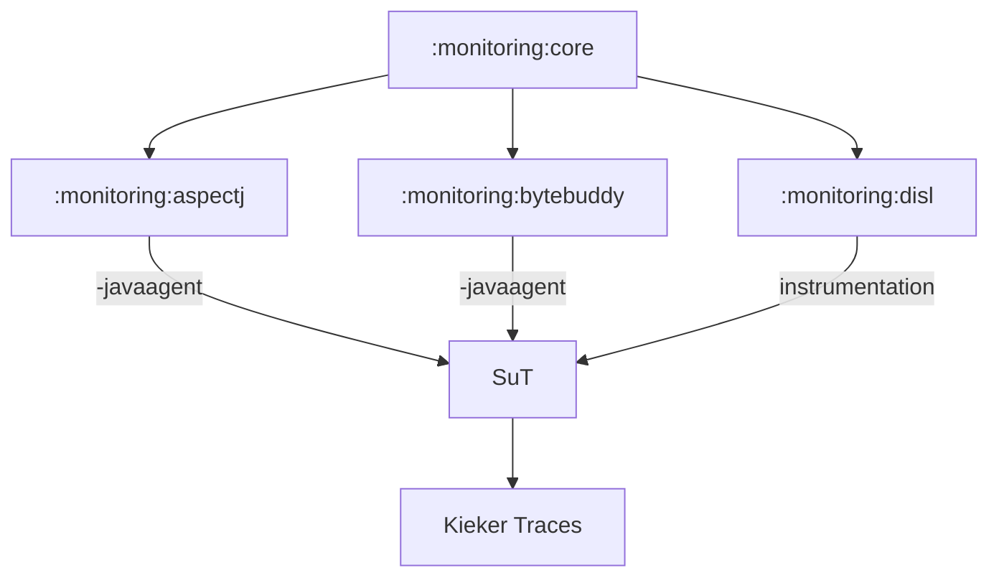

# Kieker Monitoring Component

Kiekers monitoring component offers the core monitoring code (including monitoring, queue and writing management) and the monitoring probes for different technologies. By weaving the monitoring probes into the System under Test (SuT), Kieker traces can be produced that later on can be handled by the Kieker analysis component.

For instrumentation, there are different variants:
* The AspectJ jar can be used with `-javaagent`
* The DiSL instrumentation can be used starting the DiSL script.
* Additionally, the contents from `:monitoring:core` can be weaved directly using kieker-source-instrumentation or the bytecode (compile-time) instrumentation.

## Choosing an Agent

The agents capabilities are mostly defined by the underlying instrumentation framework. There are some things to consider:
- There are subtle differences in the created monitoring logs, since the definition of signatures slightly differs (the constructor of `ClassA` would be called `ClassA.<init>()` in AspectJ, but `ClassA()` in ByteBuddy, the notion of lambda expressions differs, ...). All will give you valid logs representing your system behavior, but replacing them by one another might not exactly produce the same output (depending on which Java features you are using).
- If you are using Spring, AspectJ with its native spring capabilities might be the best choice. Furthermore, if you'd prefer to configure your agent via an XML file (`aop.xml`), AspectJ is supporting this.
- If you prefer a very basic configuration using only the environment variables `KIEKER_SIGNATURES_INCLUDE` and `KIEKER_SIGNATURES_EXCLUDE`, our ByteBuddy agent might be the way to go for you.
- According to our measurements, ByteBuddy, Javassist and DiSL produce the lowest overhead. However, this might change with updated versions and it might also be different in your setup.
