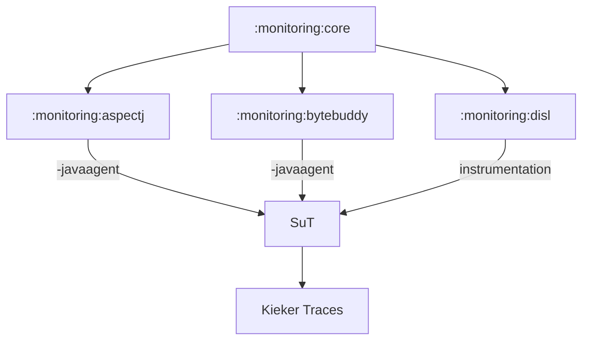

# Kieker Monitoring Component

Kiekers monitoring component offers the core monitoring code (including monitoring, queue and writing management) and the monitoring probes for different technologies. By weaving the monitoring probes into the System under Test (SuT), Kieker traces can be produced that later on can be handled by the Kieker analysis component.

For instrumentation, there are different variants:
* The AspectJ jar can be used with `-javaagent`
* The DiSL instrumentation can be used starting the DiSL script.
* Additionally, the contents from `:monitoring:core` can be weaved directly using kieker-source-instrumentation or the bytecode (compile-time) instrumentation.

